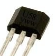

# Hall Effect Sensor

## Overview

Hall effect sensors are designed to detect the presence of a magnetic field. They are used in a variety of applications included detecting if a door is open or closed, and counting rotations of a motor. The hall effect sensor you will be using is the US5881. You can find a datasheet for this device [here](https://www.google.com/url?q=https://cdn-shop.adafruit.com/datasheets/US5881_rev007.pdf&sa=D&ust=1587613173981000). IMPORTANT: THIS IS A UA PACKAGE. THERE ARE TWO TYPES OF PACKAGES (UA AND SE) SHOWN ON THE DATASHEET.

Exercise:

1.  Collect one US5881 from the bins. The device has U58 printed on the front of the component.
2.  Record the Max. and Min. supply voltage for this device. These specifications can be found on page 4 of the datasheet.

<!-- end list -->

1.  Max. \_\_\_\_ V                Min. \_\_\_\_ V

<!-- end list -->

3.  Record the function for each of the three pins of the US5881.  This information can be found on page 3 of the datasheet. NOTE: Make sure to write down the values for the UA package not the SE package.

Pin 1: \_\_\_\_\_\_\_\_\_\_\_\_\_\_

Pin 2: \_\_\_\_\_\_\_\_\_\_\_\_\_\_

Pin 3: \_\_\_\_\_\_\_\_\_\_\_\_\_\_

TEACHER CHECK \_\_\_\_

4.  On page 7 of the datasheet you will find the Typical Three-wire Application Circuit (12.1) Set up this circuit as described. Note: You do not need to include either capacitor for testing purposes. They are only recommended for a commercial application. Make sure to always remove power from your circuit when adding a device.

TEACHER CHECK \_\_\_\_

5.  Set up a multimeter to measure the voltage output of the hall effect sensor for when it is near a magnet is near to it. You will need a paperclip to easily hold the magnet near the hall effect sensor. Record your readings below.

                Near a magnet:         \_\_\_\_\_\_\_\_\_\_\_\_ Volts

Not near a magnet:         \_\_\_\_\_\_\_\_\_\_\_\_ Volts

6.  Record the distance at which the sensor detects the magnet.

Distance from magnet:  \_\_\_\_\_\_\_ mm

TEACHER CHECK \_\_\_\_
