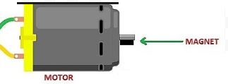
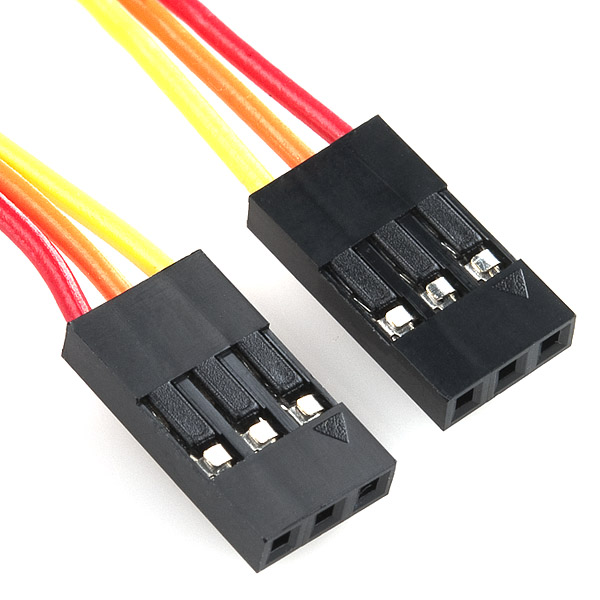

# Strip And Crimp

## Overview

In order to make secure connections between all of your electronic devices, you need to learn how to make good connections. In order to do this you will need to [strip](https://www.google.com/url?q=https://docs.google.com/document/d/1BmZbXzxnD2j17QToSZ9jeZmnP7burwfksfQq2v4zu-Y/edit%23heading%3Dh.iu1a5wiv6hpy&sa=D&ust=1587613173984000) wires and [crimp](https://www.google.com/url?q=https://docs.google.com/document/d/1BmZbXzxnD2j17QToSZ9jeZmnP7burwfksfQq2v4zu-Y/edit%23heading%3Dh.7su0yza1ij0z&sa=D&ust=1587613173985000) wires.

### Exercise:

Crimp a wire and show your work to your teacher. Repeat until you get it right.

  - Standard Molex connector
  - JST male and female connector
  - Barrel connector
    -----

TACHOMETER CHALLENGE

# Overview

In this challenge you will measure the speed of a motor using a magnet, hall effect sensor and oscilloscope. Placing a magnet on the shaft of a motor, the hall effect will detect every time the shaft turns one revolution. Using an oscilloscope, you can measure the time it takes for each revolution.

Exercise:

1.  Complete the exercise (Hall Effect Sensors) described above.
2.  Find a motor in the back room. The motor should have no gear reduction. If you don’t know what this means, you can ask your teacher.
3.  Determine the correct voltage for driving the motor. If it is not listed on the motor bin or on the motor itself, look up the motors part number (listed on motor). If this fails, assume the motor runs at 6V.
4.  Connect the motor directly to a power supply using test leads and confirm that it spins at the correct voltage.
5.  Make (or find) a three-wire extension that is more than 6-inches in length. The extension should have a three pin header on each end. This will allow you to move your hall effect sensor off the breadboard.

6.  Place the hall effect sensor in one end of the cable and place the other end in the breadboard, in the same place where you had your sensor.
7.  Set up your oscilloscope to read the output of the hall effect sensor. The ground lead should be connected to ground and the signal lead should be connected to the output of the hall effect sensor.
8.  Turn on the motor.
9.  Place the hall effect sensor near the spinning magnet until you begin to see evenly spaced pulses on your oscilloscope.
10. Adjust the TIME/DIV so that you easily see only one or two complete pulses on the screen. Note that a complete pulse is comprised of one high cycle and one low cycle. Complete the following.

<!-- end list -->

1.  Time between each horizontal division:                 \_\_\_\_\_\_\_\_
2.  Number of divisions for each complete cycle:        \_\_\_\_\_\_\_\_
3.  Total time for each complete cycle:                         \_\_\_\_\_\_\_\_
4.  Calculated frequency (the inverse of the total time):         \_\_\_\_\_\_\_\_
5.  Frequency reported by scope:                        \_\_\_\_\_\_\_\_

<!-- end list -->

11. Calculate revolutions per minute (RPM). The speed of motors is most commonly measured in RPM. On your own, using the information you have collected to calculate RPM. Show your work below.
    -----

SEVEN SEGMENT DISPLAY

# Overview

The four digit seven segment display provides an easy and quick way to display numbers. It is also highly visible from a distance. The display can display numbers in both decimal and [hexadecimal](https://www.google.com/url?q=https://docs.google.com/document/d/1BmZbXzxnD2j17QToSZ9jeZmnP7burwfksfQq2v4zu-Y/edit%23heading%3Dh.r9xkk2b3evb&sa=D&ust=1587613173990000) since it can display the characters A-F. It can be used as clock display since it contains a colon between the two pairs of digits.

### Exercise:

Remove power and wire up the four digit display to your breadboard. Note that there are only four required connections. The device communicates with your microcontroller over [I2C](https://www.google.com/url?q=https://docs.google.com/document/d/1BmZbXzxnD2j17QToSZ9jeZmnP7burwfksfQq2v4zu-Y/edit%23heading%3Dh.zbv2l6wpi6ec&sa=D&ust=1587613173990000). The pin marked D (data) should be connected to SDA on your microcontroller. The pin marked C (clock) should be connected to SCL on your microcontroller. You can locate the I2C pins (SDA, SCL) on your Metro Mini from this [diagram](https://www.google.com/url?q=https://docs.google.com/document/d/1BmZbXzxnD2j17QToSZ9jeZmnP7burwfksfQq2v4zu-Y/edit%23heading%3Dh.bk51dfzckrxr&sa=D&ust=1587613173991000).

 TEACHER CHECK \_\_\_\_

### Exercise:

1.  Open and download the example code Examples/Adafruit LED Backpack Library/sevenseg. If you cannot find this file, you can install the library Adafruit LED Backpack. You can find more information about managing libraries [here](https://www.google.com/url?q=https://docs.google.com/document/d/1BmZbXzxnD2j17QToSZ9jeZmnP7burwfksfQq2v4zu-Y/edit%23heading%3Dh.5ie0wlz76yki&sa=D&ust=1587613173992000). If the code does not compile, you may need to install the Arduino GFX library as well.

TEACHER CHECK \_\_\_\_

2.  Make a copy of the code and modify the copy so that it only displays a single number. Make sure you remove all of the code you do not need.
3.  Modify your new code file so that your displays counts from 0 to 120 and repeats with a 10ms delay. You will need to use a [for loop](https://www.google.com/url?q=https://docs.google.com/document/d/1BmZbXzxnD2j17QToSZ9jeZmnP7burwfksfQq2v4zu-Y/edit%23heading%3Dh.2u7q6orum403&sa=D&ust=1587613173992000) to do this.
4.  Using the MCP9808 temperature sensor, display the temperature on the LED display. In order to do this, you will need to combine minimal code for the temperature sensor with minimal code for the LED display.

 TEACHER CHECK \_\_\_\_
