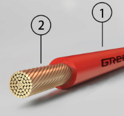
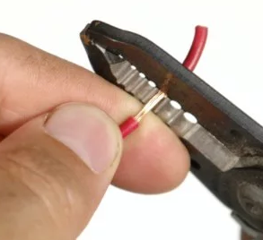
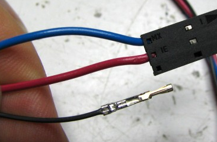

Strip And Crimp
===============

Overview
--------

In order to make secure connections between all of your electronic devices, you need to learn how to make good connections. In order to do this you will need to learn to strip and crimp wires.

Strip Wire
~~~~~~~~~~~

Stripping a wire is the process of removing some of the jacket from the conductor. 

   **1) Jacket   2) Conductor**
   
This is done using a wire stripper as shown below.
 

Crimp Wire
~~~~~~~~~~~
Crimping a wire is the process of adding a crimp connector as shown in the image below. 
 

Exercise:
~~~~~~~~~

Find student who knows how to strip and crimp a wire and ask them to teach you. Crimp a wire and show your work to your teacher. Repeat until you get it
right.

