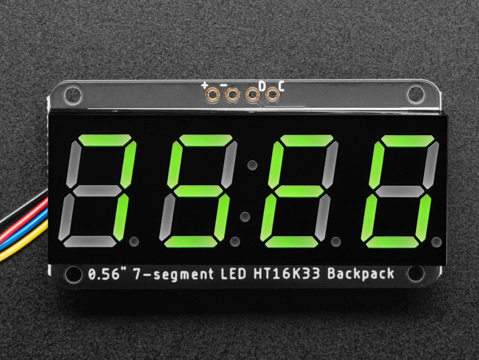

Seven Segment Display
===============

Overview
--------

The four-digit seven segment display (shown below) provides an easy and quick way to display numbers. It is also highly visible from a distance. Each segment can display the digits 0-9 as well as the characters A-F. It can also be used as clock display since it contains a colon between the two pairs of digits. Like the MCP9808 temperature sensor, this device also uses the I2C protocol to communicate with the microcontroller. 

Exercise:
~~~~~~~~~

**Remember to always remove power from your board before adding any new component!**

Add the display to your board and make the connections as shown below. IMPORTANT: make sure to get the power and ground correct. Reversing these WILL destroy this board.

- Connect + to the power bus of your breadboard.
- Connect - to the ground bus of your breadboard.
- Connect D (data) to A4 (SDA) of your microcontroller.
- Connect C (clock) to A5 (SCL) of your microcontroller.

 TEACHER CHECK \_\_\_\_

#. Open and download the example code Examples/Adafruit LED Backpack Library/sevenseg. If you cannot find this file, you can install the library Adafruit LED Backpack using the manage libraries function.

   TEACHER CHECK \_\_\_\_

#. Make a copy of the code. 

#. Modify the copy so that it only displays a single number. You can do this by commenting out one line of code at a time and testing. 
   
#. Now modify your new code file so that your displays counts from 0 to 120 and repeats with a 10ms delay. You can do this using a for loop.

 TEACHER CHECK \_\_\_\_
