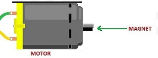

Tachometer Challenge
===============

Overview
--------

In this challenge you will measure the speed of a motor using a magnet,
hall effect sensor and oscilloscope. Placing a magnet on the shaft of a
motor, the hall effect will detect every time the shaft turns one
revolution. Using an oscilloscope, you can measure the time it takes for
each revolution.

Exercise:

1. Complete the exercise (Hall Effect Sensors) described above.
2. Find a motor in the back room. The motor should have no gear
   reduction. If you don’t know what this means, you can ask your
   teacher.
3. Determine the correct voltage for driving the motor. If it is not
   listed on the motor bin or on the motor itself, look up the motors
   part number (listed on motor). If this fails, assume the motor runs
   at 6V.
4. Connect the motor directly to a power supply using test leads and
   confirm that it spins at the correct voltage.
5. Make (or find) a three-wire extension that is more than 6-inches in
   length. The extension should have a three pin header on each end.
   This will allow you to move your hall effect sensor off the
   breadboard.

.. figure:: images/image67.png
   :alt: 

6.  Place the hall effect sensor in one end of the cable and place the
    other end in the breadboard, in the same place where you had your
    sensor.
7.  Set up your oscilloscope to read the output of the hall effect
    sensor. The ground lead should be connected to ground and the signal
    lead should be connected to the output of the hall effect sensor.
8.  Turn on the motor.
9.  Place the hall effect sensor near the spinning magnet until you
    begin to see evenly spaced pulses on your oscilloscope.
10. Adjust the TIME/DIV so that you easily see only one or two complete
    pulses on the screen. Note that a complete pulse is comprised of one
    high cycle and one low cycle. Complete the following.

.. raw:: html

   <!-- end list -->

1. Time between each horizontal division:
                   \_\_\_\_\_\_\_\_
2. Number of divisions for each complete cycle:        \_\_\_\_\_\_\_\_
3. Total time for each complete cycle:
                           \_\_\_\_\_\_\_\_
4. Calculated frequency (the inverse of the total time):
           \_\_\_\_\_\_\_\_
5. Frequency reported by scope:                        \_\_\_\_\_\_\_\_

.. raw:: html

   <!-- end list -->

11. .. rubric:: Calculate revolutions per minute (RPM). The speed of
       motors is most commonly measured in RPM. On your own, using the
       information you have collected to calculate RPM. Show your work
       below.
       :name: calculate-revolutions-per-minute-rpm.-the-speed-of-motors-is-most-commonly-measured-in-rpm.-on-your-own-using-the-information-you-have-collected-to-calculate-rpm.-show-your-work-below.
