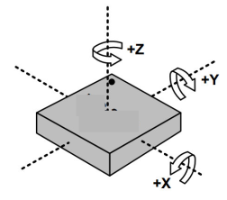

# Accelerometer

## Overview

In this lesson you will use and accelerometer to measure tilt in three axis. The LIS3DH is a 3-axis accelerometer which can sense tilt in a three coordinate system as shown below. This devices uses the I2C protocol to communicate with your microcontroller.

# Setup

1.  Collect an LIS3DH from the grey bins.
2.  Disconnect your breadboard from power (USB cable).
3.  Place it on your breadboard and connect

<!-- end list -->

1.  Vin to 5v
2.  GND to ground
3.  SCL to SCL on your Metro Mini
4.  SDA to SDA on your Metro Mini

TEACHER CHECK \_\_\_\_

# Software

1.  Open File/Examples/Adafruit LIS3DH/acceldemo
2.  Compile code. If you code does not compile than you may need to install the Adafruit Unified Sensor library.
3.  Upload the code to your board.
4.  Open your Serial Monitor. You should see the values of all 3 axis displayed.

 TEACHER CHECK \_\_\_\_

# Modify

1.  Make copy of the example file and modify it so that it displays only the values for the X axis as raw data. Make sure you remove or comment out all the code that you do not need for this purpose.

 TEACHER CHECK \_\_\_\_

2.  Modify your simpler code to display the X axis on the seven segment display.

 TEACHER CHECK \_\_\_\_

3.  Modify your code to display the acceleration for the X axis in m/s2 (meters per second squared). Turn your board and note the change in acceleration values. Note that 9.8m/s2 is the gravity at sea level. You will need to carefully examine the original example code to find out how to display your raw results in m/s2.

 TEACHER CHECK \_\_\_\_
