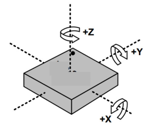

Accelerometer
=============

Overview
--------

In this lesson you will use and accelerometer to measure tilt in three
axis. The LIS3DH is a 3-axis accelerometer which can sense tilt in a
three coordinate system as shown below. This devices uses the I2C
protocol to communicate with your microcontroller.

Setup
-----

#. Collect an LIS3DH from the bin Sensors(Misc.)
#. Disconnect your breadboard from power (USB cable). If you are using a short USB cable, you might want to swap it for a longer one. This will allow you to more easily 
   test the tilt of your breadboard.
#. Place it on your breadboard and connect pin the following configuration.

   #. Vin to 5v
   #. GND to ground
   #. SCL to SCL on your Metro Mini
   #. SDA to SDA on your Metro Mini

TEACHER CHECK \_\_\_\_

Software
--------

1. Open File/Examples/Adafruit LIS3DH/acceldemo
2. Compile code. If you code does not compile than you may need to
   install the Adafruit Unified Sensor library.
3. Upload the code to your board.
4. Open your Serial Monitor. You should see the values of all 3 axis
   displayed.

 TEACHER CHECK \_\_\_\_

Modify
------

1. Make copy of the example file and modify it so that it displays only
   the acceleration value (m/s2) for the X axis in your serial monitor. Again, remember to comment out lines of code until you are sure you do not need them.
   Turn your board and note the change in
   acceleration values. It should range from 0.0m/s2 to 9.8m/s2 which is the gravity at sea level.
   You will need to carefully examine the original example code to find
   out how to display your raw results in m/s2.

 TEACHER CHECK \_\_\_\_

2. Modify your simpler code to now display the X axis on the seven segment
   display.

 TEACHER CHECK \_\_\_\_

