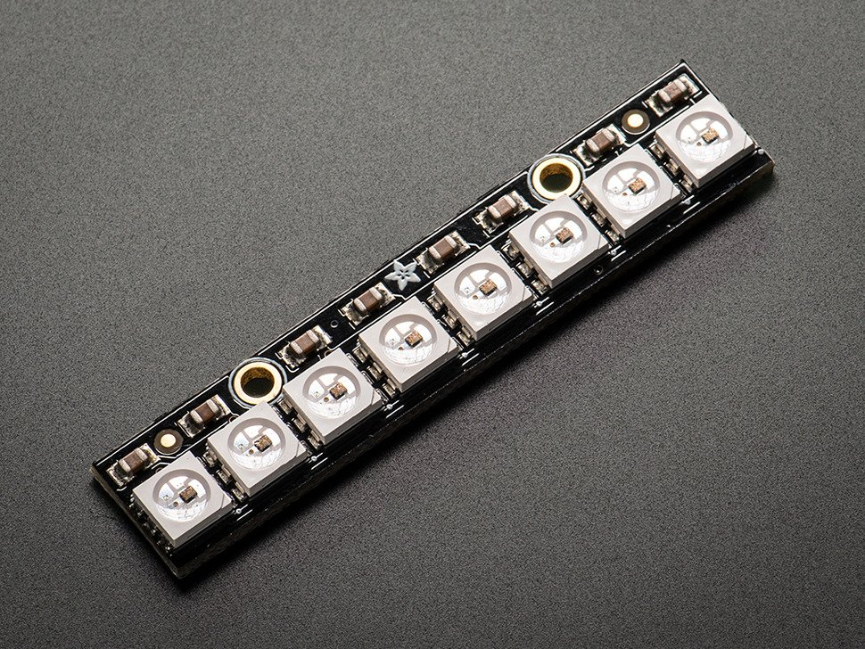

Neopixel Stick
==============

Overview
--------

The neopixel stick is a rigid strip of eight neopixels. Neopixels are addressable LEDs that can display any one of over 16 million colors. Each neopixel includes one red, one green and one blue LED that can each display 255 shades of color. Multiplying 255 (shades of red) by 255 (shades of blue) by 255 (shades of green) gives you a total of 16,777,216 possible colors! These are the same LEDs that are in long colored LED strips, and can be controlled with the same code.

Exercise
-----
#. Remove power from your breadboard.
#. Insert the neopixel stick in your breadboard
#. Connect the neopixel as described below.

   - GND to ground
   - 5VCC to power
   - DIN to pin 6 of your Metro Mini (This is the data line)
   
#. Program the Metro Mini using Examples/Adafruit Neopixel/simple. If this file is not in your examples directory, you will need to install it.

   TEACHER CHECK \_\_\_\_

#. Modify the code so that it just sets the 3rd LED from the bottom to a dull green. The remaining LEDs should be off.

   TEACHER CHECK \_\_\_\_

