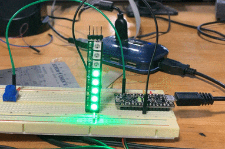
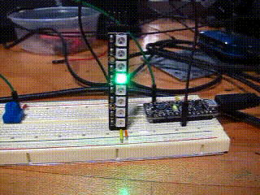
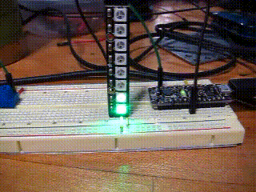
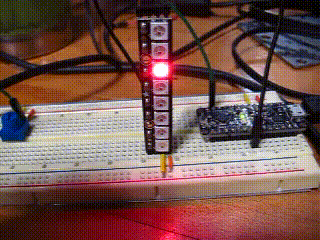
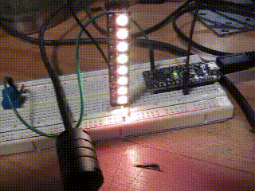

Neopixel Challenges
==============

Overview
--------

The following are a set of challenges using the neopixel stick.

Exercise:
~~~~~~~~~

1. Using a for loop, write a program to turn on each LED on the neopixel in order and then turn them all off. An example is shown in the gif below.
   Note that you can use the following command to turn off all the LEDs.
   
.. code-block:: C
   
   pixels.clear();

 TEACHER CHECK \_\_\_\_

2. Modify your code so that one LED lights as it moves up the Neopixel Stick. An example is shown below.
   

 TEACHER CHECK \_\_\_\_

3. Modify your code so that the one LED moves up AND down on the neopixel stick. Also increase the speed as shown in the example below.

4. Rewrite your code so that a single LED changes from full red (255) to yellow (red + green). You will need to use a for loop to increase the
   value of green until it is the same as the value of the red.
   

4. Modify your code so that all eight LEDs changes from full red (255) to yellow. To do this correctly, you will need place a for loop inside of
   your existing loop so that all LEDs are set instead of just one.
   

Modify your code so that a potentiometer can be used to control the
   number of LEDs that are lit on the neopixel strip. The more you turn
   the dial, the more LEDs are lit. Note that your analog input ranges
   from 0 to 1023 but you only have 8 leds (numbered 0 to 7) so you will
   need to convert the range. The `mapping
   function <https://www.google.com/url?q=https://docs.google.com/document/d/1BmZbXzxnD2j17QToSZ9jeZmnP7burwfksfQq2v4zu-Y/edit%23heading%3Dh.w4r79820c3cs&sa=D&ust=1587613173999000>`__ can
   be helpful here. Also note that initially, you may not have a way to
   turn the LEDs off.

 TEACHER CHECK \_\_\_

4. Modify your code so that when the potentiometer is set all the way to
   the left no neopixels should be lit, and when it is set all the way
   to the right, all the neopixels should be lit. You will need to a one
   line that turns off the previous LED.

 TEACHER CHECK \_\_\_\_
