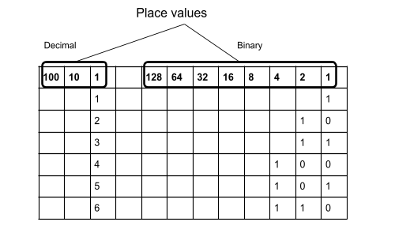

Binary
======

Overview
--------

Binary, also known as base-2, is a way of representing numbers with only two digits (0 and 1). Numbers can be represented in any number base from 2 and up. Common number bases used in programming include base-2 (binary), base-10 (decimal) and base-16 (hex). Decimal or base-10 which includes 10 digits (0, 1, 2, 3, 4, 5, 6, 7, 8, 9) is what humans generally use for our everyday exchange of numbers. 

Since computers (and microcontrollers) are only capable of storing information in one of two states, all information from a simple number to a full-length video is stored in binary on computers. Though we mostly write numbers in decimal in our code, it is sometimes more convenient to use binary or hexadecimal. We will discuss hexadecimal in a later lesson. Below is table showing all three.

.. list-table:: Base Table
   :widths: 25 25 50 50
   :header-rows: 1

   * - Format Name
     - Base
     - Digits
     - Total Digits
   * - Binary
     - Base 2
     - 0, 1
     - 2
   * - Decimal
     - Base 10
     - 0, 1, 2, 3, 4, 5, 6, 7, 8, 9
     - 10
   * - Hexadecimal (Hex)
     - Base 16
     - 0, 1, 2, 3, 4, 5, 6, 7, 8, 9, A, B, C, D, E, F
     - 16

**Counting in binary** is similar to counting in decimal except with different place values. Below is a table showing the place values for both decimal and binary. 
 

Exercise
--------
#. Copy the binary portion of the above table in your notebook, leaving out the zeros and ones. 
#. On this table write the numbers 10, 30, 35, 112, and 87 in binary.

You can use the serial print command to print numbers in binary as well as decimal. The following print command will print a number in decimal by default.

.. code-block:: C

   Serial.print(6);                //this will print 6

Using an optional argument you can specify alternative base representations.

.. code-block:: C

   Serial.print(7, DEC);        //this will print 7

   Serial.print(7, BIN);        //this will print 111

Exercise:
~~~~~~~~~

#. Using what you learned above print the numbers 1, 9 and 23 in both decimal and binary in your Serial Monitor.

   TEACHER CHECK \_\_\_

#. Print two columns of numbers, one in decimal and one in binary. These numbers should increment from 0 and have a .3 second delay between increments.

   TEACHER CHECK \_\_\_\_

