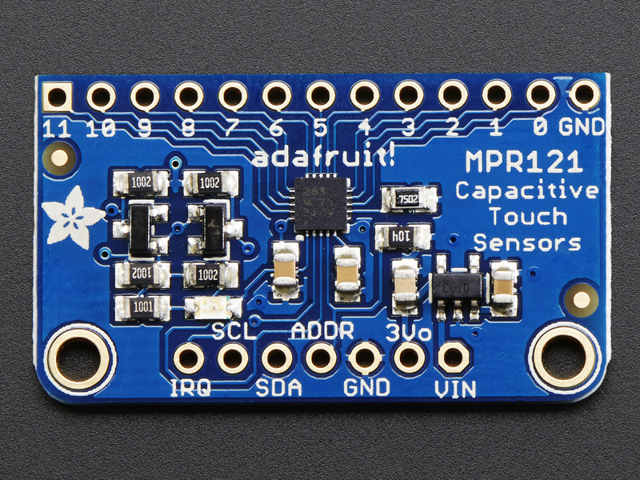
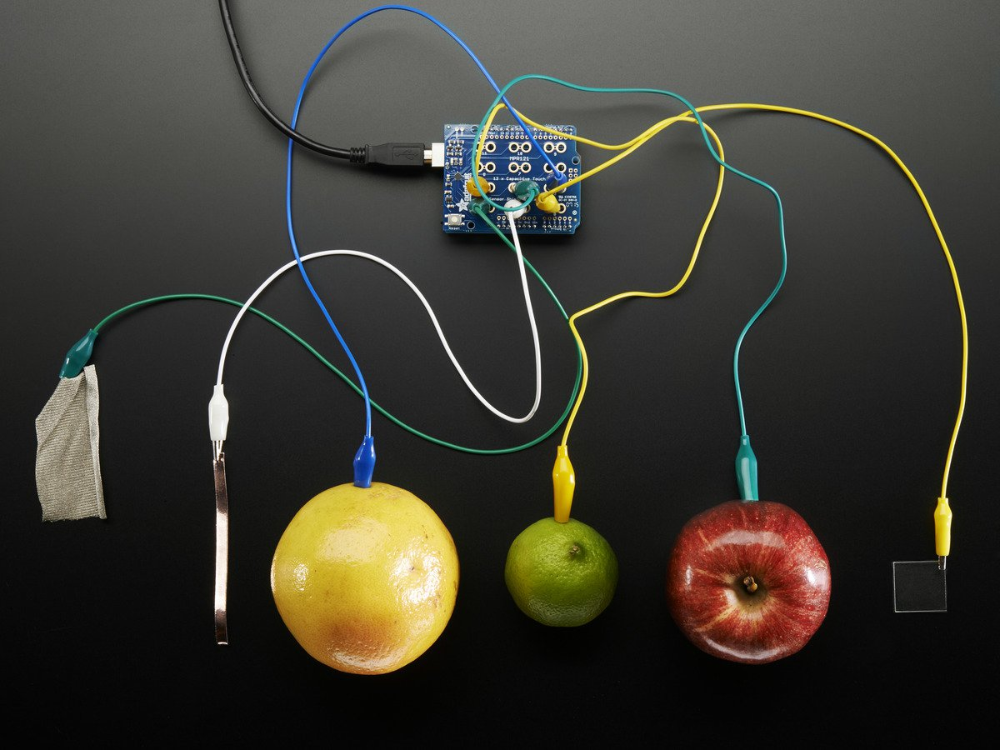

# Capacitive Touch Sensor

## Overview

In this lesson, you will learn how design and read a 12 input capacitive keypad. Capacitive touch keypads are often found on computer screens allowing the user to just touch the screen to trigger a key. The work by responding to the electric charge in human skin.

# MRP121

The MPR121 is capacitive touch sensor controller that can be used to respond to 12 capacitive touch sensors.

# Wiring

Above is a picture of the Adafruit MPR121 module. Wire the module as follows.

GND pins to ground.

VIN pin to 5 volts

SCL pin to A5 on your Arduino or Metro

SDA pin to A4 on your Arduino or Metro

# Testing

Follow the instructions below to test that you have wired your module correctly.

1.  Open the file Examples/AdafruitMPR121/MPR121test and upload it to your Metro Mini.
2.  Open your Serial Monitor and you should see:

#### Adafruit MPR121 Capacitive Touch sensor test

#### MPR121 found\!

If you touch any of the actual pins (labeled 0 through 11) you should see number of the pin you touched appear on the terminal window.

# Electrodes

You can make electrodes from just about anything that conducts i.e. metal foil or even pieces of  fruit. As a start, you will make three buttons from conductive tape and wires.

As a first step, I recommend making a simple four key keypad as shown below. Make sure to use 22g [solid core](https://www.google.com/url?q=https://docs.google.com/document/d/1BmZbXzxnD2j17QToSZ9jeZmnP7burwfksfQq2v4zu-Y/edit%23heading%3Dh.ya5gjhqj28ms&sa=D&ust=1587613174018000) wire. You can find this in the wire bin.

You will need to strip the end of the wire before placing it under the conductive tape and then taping the conductive tape to the cardboard. Once you have completed your keypad, demonstrate the pad for your teacher.

TEACHER CHECK \_\_\_\_

# Challenge

Add a piezo speaker to your board and modify the code so that it plays a different tone for each key you press. The circuit should each tone as long as the key is pressed. This means you will need to check for the key being down and up.

## Minimize Code

The first step is to save a version of the sample code file (i.e. rename it and save it in your personal local directory) Next try to remove parts of the code you don’t need. This is particularly difficult with this example file because it is fairly complex.

## Read Results

The function that returns the value of the key presses (which keys are pressed and which keys are unpressed) is:

#### touch = cap.touched();

NOTE: touch is just a variable for storing the value returned from the function. You could use any variable in its place.

The value (touch) is returned as a 12-bit number. This means that the possible range is 0 to 4095 (or all 12 bits set to 1 i.e. 111111111111). This is significant because the touch sensor has 12 inputs, so the value of each of the inputs can be represented by one of the 12 bits.

The following table shows some possible 12-bit binary results, their decimal equivalent and the keys which would be pressed.

\#

Keys

11

10

9

8

7

6

5

4

3

2

1

0

5

0

0

0

0

0

0

0

0

0

1

0

1

2

0

0

0

0

0

0

0

0

0

0

1

0

1

0

0

0

0

0

0

0

0

0

0

0

1

#### 

Print the results of the key presses to the Serial Monitor. Make sure to print the results in [binary](https://www.google.com/url?q=https://docs.google.com/document/d/1BmZbXzxnD2j17QToSZ9jeZmnP7burwfksfQq2v4zu-Y/edit%23heading%3Dh.2bsdktk7z98&sa=D&ust=1587613174037000). Note that the key press results are coded in 12 bits of binary with each bit representing a key press.

# Reading Input

The following code should produce a 1, 2 or 4 depending on which electrode is touched.

\#include \<Wire.h\>

\#include "Adafruit\_MPR121.h"

int touch;

Adafruit\_MPR121 cap = Adafruit\_MPR121();

void setup() {

  Serial.begin(9600);

  cap.begin(0x5A);

}

void loop() {

  touch = cap.touched();

  if (touch \!= 0) {

    Serial.print(touch,BIN);

  }

  delay(200);

}

##### NOT FINISHED
