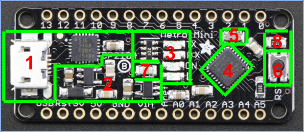
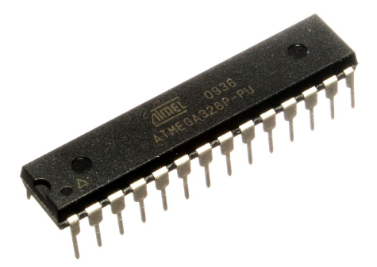
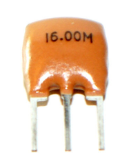
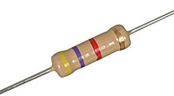

# Building A Breadboard Arduino

## Overview

In this lesson you are going to construct a Metromini/Arduino Uno on your breadboard. The advantage of building a the Arduino on a breadboard is that:

1.  It costs less. The Metro Mini costs $12.50. The parts to build this device cost under $3.00. This is important if you are building a permanent project and don’t need features such as on-board USB, a voltage regulator and reset button.

<!-- end list -->

2.  It is more configurable: Using breadboard version of the device, you can easily change the power supply from 1.8V to 5.0V. You can also easily change the clock speed of the clock from a slow 32.768 real time clock pulse to a fast 20Mhz.

Above is a diagram of the Metro Mini broken down into functional groups of components. Below is a description of each of these groups. The ones in bold are the ones that will be included in your breadboard version. For these devices the name used on your breadboard schematic is included.

1.  USB Converter. This section of the board is responsible for converting the USB signal from the computer to a pair of serial signals that can be used by the microcontroller.
2.  Power Conversion: This section of the board is responsible for providing direct power from the USB as well as regulated power for 5V and 3.3V.
3.  LEDs: This section includes LEDs and their resistors which are used to indicate power on the board and whether data is being sent to or from the device.
4.  Microcontroller: This is a surface mount version of the ATMega328p, which is the microcontroller that you program. (IC1)
5.  Clock: This is the crystal clock resonator that used to provide the correct timing “heartbeat” for your controller. (Y1)
6.  Reset: The reset button is used to reset the code on the controller back to the beginning. It is useful if the code gets stuck in a bad state. (S1)
7.  Filter: This is a capacitor that is being used to filter or clean the power supply against voltage spikes. (C2)
8.  Pullup: This is a resistor that is used to prevent the microcontroller from going into the reset state.  (R2)

# Collecting components

You will now build a working version of the Metromini or Arduino Uno using individual components and on a breadboard. Below are the components you need to collect. You will only need one of each.

|                            |                         |
| -------------------------- | ----------------------- |
| Item                       | Image                   |
| ATMega328p microcontroller |  |
| 16Mhz Resonator            |  |
| .1uF Capacitor             |  |
| 4.7K Resistor              |  |
| Momentary switch           |  |

# Breadboard Schematic

The following is the basic microcontroller circuit. Carefully construct this circuit on your breadboard. Make sure to use short wires for your all your connections. Neatness counts\! Check [here](https://www.google.com/url?q=https://docs.google.com/document/d/1BmZbXzxnD2j17QToSZ9jeZmnP7burwfksfQq2v4zu-Y/edit%23heading%3Dh.bk51dfzckrxr&sa=D&ust=1587613174049000) for a reminder on how to determine pin numbers on an integrated circuit.

|      |                             |
| ---- | --------------------------- |
| Name | Description                 |
| IC1  | The ATMega328p At           |
| Y1   | The crystal clock resonator |
| C2   | The filter capacitor        |
| R2   | The pullup resistor         |

 TEACHER CHECK \_\_\_\_

# Programming Cable

The programming cable connects your microcontroller to the computer and allows you to send code compiled on the computer to your microcontroller. The cable communicates with your controller via the TXD, RXD and includes circuitry for converting USB signals from the computer to USART signals that the microcontroller can understand.

  - TXD stands for transmit data and it is located at pin 3 of your microcontroller. This pin can be used to send data to other devices such as your computer.
  - RXD stands for receive data and it is located at pin 2 of your microcontroller. This pin can be used to receive data from other devices such as your computer.

Below is a table showing you how to connect your cable to your microcontroller. Note that the RX (receive) on the cable side is connected to the TXD (transmit) on the microcontroller and the TX (transmit) on the cable side is connected to the RXD (receive) on the microcontroller. This should make sense. You can see a diagram of the cable [here](https://www.google.com/url?q=https://cdn-shop.adafruit.com/datasheets/FT232_Model.pdf&sa=D&ust=1587613174054000).

Using the table below connect the programming cable to your microcontroller.

|                |                        |
| -------------- | ---------------------- |
| Cable          | Microcontroller (side) |
| RX (yellow)    | TXD                    |
| TX (orange)    | RXD                    |
| Ground (black) | GND                    |
| 5V (red)       | 5V                     |

 TEACHER CHECK \_\_\_\_

# Uploading Code

Uploading code to the microcontroller with the cable is slightly more complicated as compared with using a Metromini or Arduino Uno. The following are two steps you will need to take.

1.  Board Selection: The first change is that you will need to select Arduino Duemilanove or Diecimila as your board type under the Tools/Board menu.
2.  Button: You will also need to press the button you place on your board as soon as you see lights flashing in your programming cable.

<!-- end list -->

1.  Selected the Upload button on the Arduino IDE
2.  Wait for lights to flash inside the USB programming cable
3.  Press button breadboard. If both lights start flashing rapidly, you upload should be successful.
