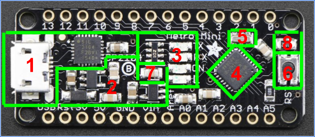
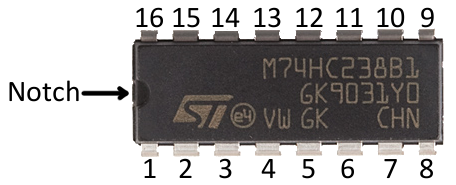
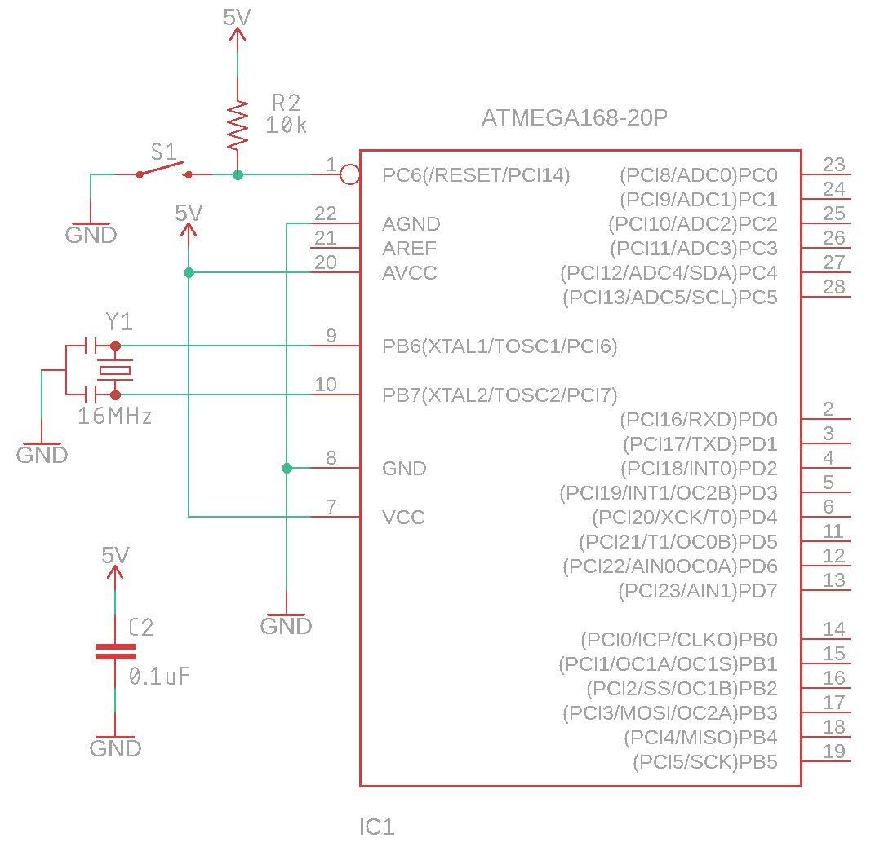

Building A Breadboard Arduino
=============================

Overview
--------

In this lesson you are going to construct a Metromini/Arduino Uno on your breadboard. The advantage of building a the Arduino on a breadboard is that:

#. It costs less. The Metro Mini costs $12.50. The parts to build this device cost under $3.00. This is important if you are building a permanent project and don’t need features such as on-board USB, a voltage regulator and reset button.

#. It is more configurable: Using breadboard version of the device, you can easily change the power supply from 1.8V to 5.0V. You can also easily change the clock speed from a slow 32.768 real time clock pulse to a fast 20Mhz.

Above is a diagram of the Metro Mini broken down into functional groups of components. Below is a description of each of these groups. For these devices the name used on your breadboard schematic is included.

#. USB Converter. This section of the board is responsible for converting the USB signal from the computer to a pair of serial signals that can be used by the microcontroller.
#. Power Conversion: This section of the board is responsible for providing direct power from the USB as well as regulated power for 5V and 3.3V.
#. LEDs: This section includes LEDs and their resistors which are used to indicate power on the board and whether data is being sent to or from the device.
#. Microcontroller: This is a surface mount version of the ATMega328p, which is the microcontroller that you program. (IC1)
#. Clock: This is the crystal clock resonator that used to provide the correct timing “heartbeat” for your controller. (Y1)
#. Reset: The reset button is used to reset the code on the controller back to the beginning. It is useful if the code gets stuck in a bad state. (S1)
#. Filter: This is a capacitor that is being used to filter or clean the power supply against voltage spikes. (C2)
#. Pullup: This is a resistor that is used to prevent the microcontroller from going into the reset state.  (R2)

Collecting components
---------------------

You will now build a working version of the Metromini or Arduino Uno using individual components and on a breadboard. Below are the components you need to collect. You will only need one of each.

+------------------------------+------------+
| Item                         | Image      |
+------------------------------+------------+
| ATMega328p microcontroller   | |image0|   |
+------------------------------+------------+
| 16Mhz Resonator              | |image1|   |
+------------------------------+------------+
| .1uF Capacitor               | |image2|   |
+------------------------------+------------+
| 4.7K Resistor                | |image3|   |
+------------------------------+------------+
| Momentary switch             | |image4|   |
+------------------------------+------------+

Breadboard Schematic
--------------------

The following is the basic microcontroller circuit. Carefully construct this circuit on your breadboard. Make sure to use short wires for your all your connections. Neatness counts! **Important**: The numbers on the IC1 correspond to order of the pins on the actual IC. All ICs start their pin counts at 1 under a notch or divit. The counting always continues in a counterclockwise direction around the IC. An example is below.

+--------+-------------------------------+
| Name   | Description                   |
+--------+-------------------------------+
| IC1    | The ATMega328p At             |
+--------+-------------------------------+
| Y1     | The crystal clock resonator   |
+--------+-------------------------------+
| C2     | The filter capacitor          |
+--------+-------------------------------+
| R2     | The pullup resistor           |
+--------+-------------------------------+

 TEACHER CHECK \_\_\_\_

