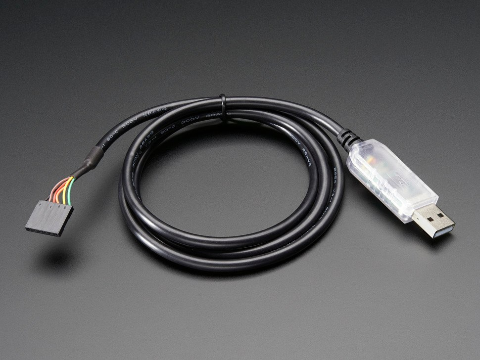
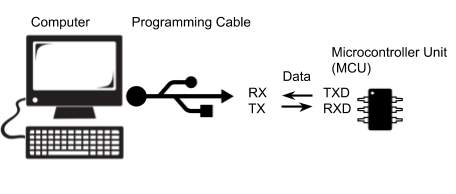
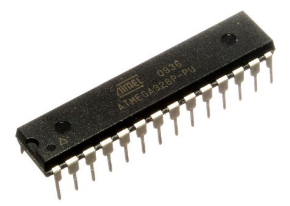
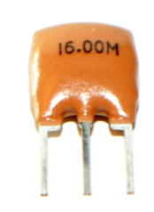
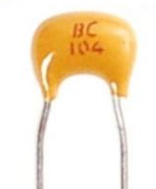
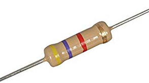
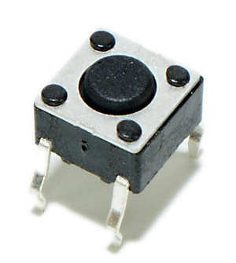

Programming A Breadboard Arduino
=============================

Overview
--------

When programming your Arduino or Metro Mini you only needed a simple USB cable. This is because the circuitry required to convert the USB signal to a serial signal that is native to the Arduino was on the Arduino board. When programming your new circuit, you will need a special programming cable that includes this circuitry as shown below.

This programming cable connects your microcontroller to the computer and allows you to send code compiled on the computer to your microcontroller. The cable communicates with your controller via the TXD, RXD pins on your microcontroller and includes circuitry for converting USB signals from the computer to USART signals that the microcontroller can understand.

-  TXD stands for transmit data and it is located at pin 3 of your microcontroller. This pin can be used to send data to other devices such as your computer.
-  RXD stands for receive data and it is located at pin 2 of your microcontroller. This pin can be used to receive data from other devices such as your computer.

Below is a table showing you how to connect your cable to your microcontroller. Note that the RX (receive) on the cable side is connected to the TXD (transmit) on the microcontroller and the TX (transmit) on the cable side is connected to the RXD (receive) on the microcontroller. **IMPORTANT**: BE VERY CAREFUL TO CONNECT THE POWER AND GROUND CORRECTLY BEFORE APPLYING POWER TO YOUR CIRCUIT.

Using the table below connect the programming cable to your microcontroller.

+------------------+--------------------------+
| Cable            | Microcontroller (side)   |
+------------------+--------------------------+
| RX (yellow)      | TXD                      |
+------------------+--------------------------+
| TX (orange)      | RXD                      |
+------------------+--------------------------+
| Ground (black)   | GND                      |
+------------------+--------------------------+
| 5V (red)         | 5V                       |
+------------------+--------------------------+

 TEACHER CHECK \_\_\_\_

Uploading Code
--------------

Uploading code to the microcontroller with the cable is slightly more complicated as compared with using a Metromini or Arduino Uno. The following are two steps you will need to take.

#. Select the Arduino Duemilanove or Diecimila as your board type under the Tools/Board menu.
#. Press the Upload button on the Arduino IDE
#. Wait for lights to flash inside the head of the USB programming cable
#. Press button breadboard. If both lights start flashing rapidly, you upload should be successful.

