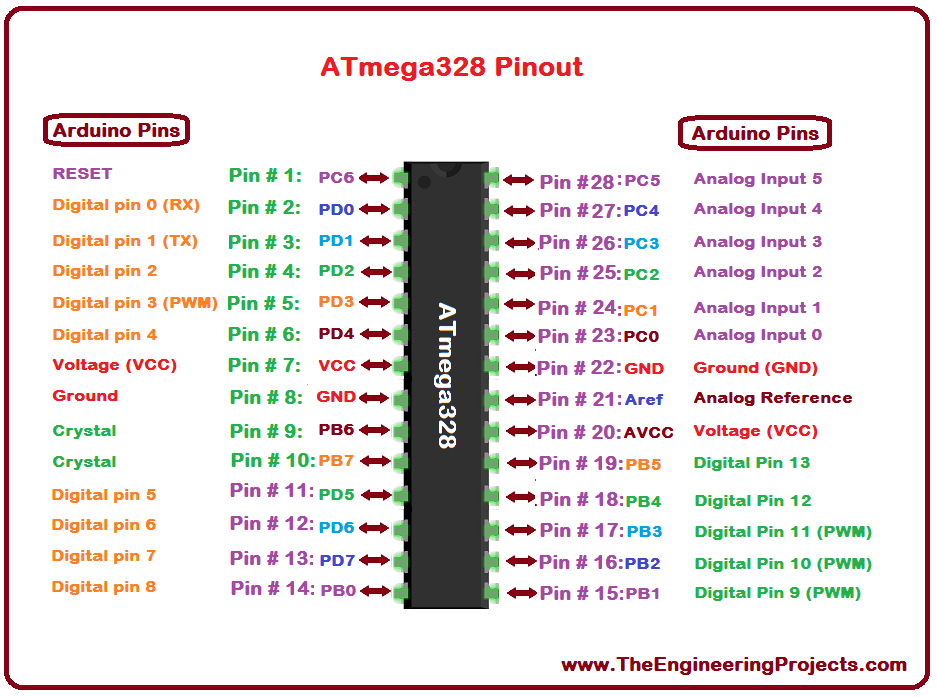

Using A Breadboard Arduino
==========================

Overview
--------

There are a few differences between using a breadboard-based Arduino versus a Metromini or Arduino Uno. One is that the ATMega328 does not have the pin names conveniently labeled on the IC. The second is that it cannot be directly powered without by a USB cable. Both issues are addressed below.

**Pin Names**: The Metromini and Arduino Uno both have labels to indicate which pins are assigned to digital 0  through digital 13 and analog 0 through analog 5. In order to use these pins correctly with the ATMega328 microcontroller on a breadboard, you will need to learn which of the “Arduino specific” pins are assigned to the actual pins on the microcontroller. 

Exercises
~~~~~~~~

Add an LED to digital pin 11 (Note that this is NOT the same as pin 11 on the ATMega328, see above) your board and write a program to flash the LED at a rate of 2 Hertz.

 TEACHER CHECK \_\_\_\_

**Board Power**: While it is possible to power the breadboard version of your Arduino Uno with a programming cable it is not convenient if you want to make a more permanent design. A permanent design should be able to be powered by a standard USB micro cable. Below is USB breakout board that you can use to connect a USB cable to your board.

Add a USB breakout header to your board so that it can be powereddirectly from a standard USB micro cable.

 TEACHER CHECK \_\_\_\_
