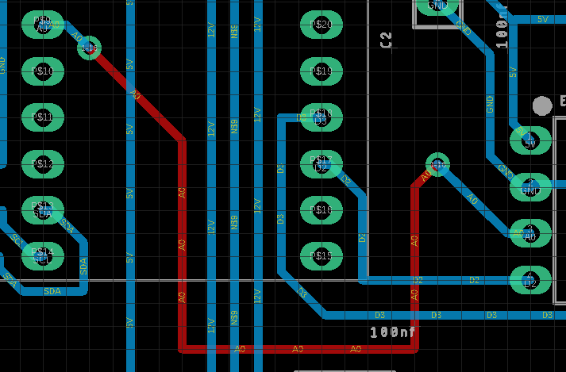
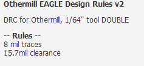

# Circuit Board Design

## Overview

Once you have finished the tutorials, you are ready to design your circuit using Eagle. Follow the steps below when designing your board.

1.  Make sure the breadboard version of your circuit includes all of the parts you need and is working correctly. Do not add anything to your Eagle circuit that you have not already testing on your breadboard.
2.  If your circuit includes a microcontroller, make sure you have a way to power your board without using the programming cable.
3.  Label all signal wires. This will make it much easier to debug your board file when something goes wrong. If your circuit includes a microcontroller, make sure to use wire labels for RX and TX.
4.  In the Eagle schematic, set the default trace width, drill diameter and pad clearance to 18mil. You can find these settings in the Net classes window under the File menu.
5.  Add all of your parts to the board and wire them exactly as they are wired on your breadboard.
6.  Use 90 degree bent headers for all your wire-to-board connections. The traces on these boards are weak and using bent headers will substantially reduces failures due to broken traces.
7.  Make sure to include a test point for ground on your board. This will make it much easier to debug with a meter.
8.  Run an ERC to make sure that all your nets are connected correctly. Fix any problems on your schematic until there are no ERC errors. If you have an ERC error, your board will not cut correctly.
9.  Make sure that all pads for all components are set to the following specifications. You will likely need to change the pad size for most, if not every, component you find in the existing libraries.

<!-- end list -->

1.  Drill = 40mil
2.  Diameter = 65mil
3.  Shape = long

<!-- end list -->

10. When making a new part in your library, make sure to include lines showing the dimension of your part.
11. Place your parts on the board. Make sure to leave room for plugging cables into your headers, i.e. do not put tall component in front of a bent header, so that it becomes inaccessible.
12. Delete the existing outline and draw a new outline around all of your parts. Note that the outline can be any shape.
13. Add four mounting holes that can fit an M3 standoff unless you have another method for mounting your circuit board.
14. Load the Design Rule (DRC) from Othermill for the 1/32” milling bit. The design rules (DRC) can be found under the Tools menu.
15. Route your board on the bottom side only. If your board does not route correctly completely follow these suggestions. If these fail, see instructions on Top Traces below.

<!-- end list -->

1.  Move parts so that signal wires overlap as little as possible.
2.  Make sure there is room between parts so that traces can fit between them

<!-- end list -->

16. Run the DRC and make sure there are no errors. If there are errors, fix them and re-run the DRC.
17. Make sure your board is designed with the minimal use of material.
18. Your board must include dimensions for the overall length and width of the board. Dimension units should be mils and in an unused layer such as info.

# Top Traces

In some cases a board cannot be routed on a single side. In this case, there are three options depending on the number of traces that are unable to route. If you have three or less wires airwires, you can simply create connections with top wires (see below) as as described below. For boards with more than three airwires you can trace vias (see below) and route wires on the top side. For very complex boards you can fully route a two sided (see below) board. This option adds a lot of complexity to the design and should only be attempted in cases where absolutely necessary.

## Top Wires

This is the simplest solution to create connect a few unrouted wires on your board. Following the instructions below you will route the wires using the top layer, though you will not cut a top layer on your board. You will simply use the vias as convenient points for soldering connections using solid core 22g wire.

1.  Select the routing tool.
2.  Set the following values in the routing tool banner. This will set your via dimensions so that it will be easy to insert 22 gauge solid core wire.

<!-- end list -->

1.   Drill = 40 mil
2.  Diameter = 65 mil
3.  Shape = round

<!-- end list -->

3.  Select the bottom layer
4.  Start making a trace from one of the pads with an unrouted trace (airwire). Before clicking the mouse move it to the layer selection and select the top layer. This will provide a via at the end of your trace.
5.  Create a short trace from the through-hole pad (as shown below). The trace should be some distance from the pad but not across any bottom traces before you place the first via by clicking the mouse.
6.  Now select the bottom layer with your mouse. You should see a via at the end of your trace again.
7.  Move the trace over all of the bottom layer traces that you need to cross until there are not bottom traces between your trace and the destination pad.
8.  Again place your via close to the pad and continue the trace to the pad.

NOTE: When you make your board you will only select the bottom layer in Othermill.

## Trace Vias

This is identical to the “top wire” method described above except that you will use the following values for your vias. In this method, you will cut both a top bottom layer on your board. You will use small rivets to connect the vias from top to bottom layer.

4.   Drill = 35 mil
5.  Diameter = 50 mil
6.  Shape = round

## Two Sided

The approach is far more complicated and should only be attempted when you have a very complicated board and many more than three wires that will not route.

DRC: The first step is to load a new DRC (shown below) that includes the correct specifications for routing a two sided board with vias and uses a 1/64 bit. If this DRC is not found in your Eagle directory ask your teacher for the file.

Pads: The next step is to change all of your through-hole pad sizes to a size that will work with the rivets. This will mean creating additional footprints for every part. These footprints must have the following values:

1.  Drill = 60 mil
2.  Diameter = 79 mil
3.  Shape = round

Vias: You will also need to set your vias to the correct specification for the rivets. You can use the specifications show above in the section “Add Vias”.

Routing (IMPORTANT): In order to minimize rivets (we have a limited supply) you must first route the board with only bottom traces enabled. Then route the board with both bottom and top traces enabled.

IMPORTANT: Before cutting your board you will need to following this [guide](https://www.google.com/url?q=https://support.bantamtools.com/hc/en-us/articles/115001658814-Double-Sided-Boards&sa=D&ust=1587613174072000) for cutting two-sided boards. You will also need to make sure you are using the 1/64th bit.

NOTE: Start with lower left corner and top side traces and holes. Then complete lower right corner and bottom side traces and outline.

1.  Place board carefully in lower left corner
2.  Mill top side traces and holes ONLY\!
3.  Place board carefully in lower right corner.
4.  Mill bottom side traces and outline ONLY\!
