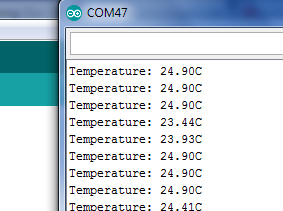

# Analog Temperature Sensor

## Overview

In this lesson you will learn how to use an analog temperature sensor. Analog temperature sensors are generally lower cost, easier to use and fairly accurate as compared with digital sensors.

## LM35

The LM35 is simple analog temperature sensor that is designed to provide results that are directly compatible with the Centigrade scale. The device is made by Texas Instruments (TI) and the [datasheet](https://www.google.com/url?q=http://www.ti.com/lit/ds/symlink/lm35.pdf&sa=D&ust=1587613174074000) for the device can easily be found on line.

### Exercises

1.  Using the diagram shown below add the temperature sensor to the breadboard.

                        

2.  Using the datasheet for the LM35 determine the lowest and highest temperature that it is capable of measuring. You can find a link to the datasheet above. The information on temperature range can be found on page one. The temperature is listed in Celsius on the datasheet. Use an online calculator to convert the Celsius to Fahrenheit.

Low Temperature: \_\_\_\_\_\_\_ Celsius                High Temperature: \_\_\_\_\_\_\_\_\_ Celsius

Low Temperature: \_\_\_\_\_\_\_ Fahrenheit        High Temperature: \_\_\_\_\_\_\_\_ Fahrenheit

TEACHER CHECK \_\_\_\_

## Circuit Testing

In order to test this circuit, you will need to test the voltage output from the LM35. The voltage output of the LM35 is proportional to the temperature in Celsius. The conversion factor is 10mV per degree Celsius. For example, 10mV would be equivalent to 1 degree Celsius and 130mV would be equivalent to 13 degrees Celsius.

### Exercise

1.  Add the LM35 to your breadboard following the diagram below. Connect the power and ground leads from the LM35 to power and ground on your circuit board. Check the diagram above to confirm that you have the correct pin out for the component.

TEACHER CHECK \_\_\_\_

2.  Measure the voltage at the output of the LM35.

<!-- end list -->

1.  Set up a multimeter to measure voltage DC.
2.  Connect the correct leads to ground and the output of the LM35. If you do not see a result, you may need to change the range to millivolts.
3.  Record the following measurements below.

        Room temperature: \_\_\_\_\_\_\_\_ millivolts         \_\_\_\_ Celsius                \_\_\_\_ Fahrenheit

Body\* temperature: \_\_\_\_\_\_\_\_\_ millivolts         \_\_\_\_ Celsius                \_\_\_\_ Fahrenheit

(\*You can either squeeze the sensor between two fingers or breathe on it, depending on which works better.)

TEACHER CHECK \_\_\_\_

## Software

Using your microcontroller you can read the voltage values from the sensor and display the temperature from your LM35 without the use of a multimeter.

### Exercise

1.  Connect the output of your LM35 to one of your analog pins. Write a program to read the voltage values of the LM35 and display them in the serial window on your screen. Note that these numbers do not directly correspond to millivolts. As you learned in the section on analog conversion, the analog converter has a range of 0 to 1023 which corresponds to a voltage from 0V to 5V.

TEACHER CHECK \_\_\_\_

2.  Modify your code so that the numbers in your serial monitor display temperature readings based in Centigrade as shown below.

<!-- end list -->

1.  Convert the the analog output to voltage. If you need help with this step you can refer to this previous lesson on [analog conversion](#id.yhzdgx4chww8). Display the voltage in your monitor.

TEACHER CHECK \_\_\_\_

2.  Convert the voltage you received in the previous step to a Centigrade value. Remember, every 10 mV is equivalent to 1 degree Centigrade. Display the Centigrade value in your monitor.

TEACHER CHECK \_\_\_\_

3.  Display the temperature in a column with the text as shown below. 

  
