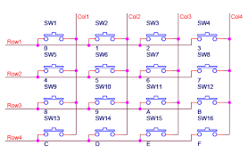

# Keypads

## Overview

Keypads are another common interface found on electronic devices and provide an easy way to enter numbers as well as provide convenient control when more than one or two buttons are needed.

A keypad is simply a set of buttons contained in a single interface. The main difference is that the buttons on the keypad are wired in a matrix. Using a matrix fewer control lines are needed for the same number of buttons. For example, a keypad with a total of 16 keys can be read with only 8 control lines. This is half the number of control lines that would be required for 16 individual buttons.

## The Matrix

All keypads are designed on a grid of rows and columns. Each pin on a keypad corresponds to either one of the rows or one of the columns. Pressing each button closes the connection between a unique set of rows and columns. (See diagram below) Unlike reading buttons, the MCU cannot simply read a pin to determine which button is pressed but must use a technique called polling. Polling will be covered as an advanced topic.

Looking at a keypad it is impossible to decipher which pin belongs to which row or column, so you will need to use a multimeter to suss this out.

### Exercise

1.  Using the continuity setting on your multimeter determine which unique pair of pins correspond to each button.

<!-- end list -->

1.  Place the two leads on any two pins on your keypad.
2.  Press each button until you find the button that is continuous for these two pair of pins. (i.e. the meter beeps) You need to press the button down for at least  a second for the meter to register.
3.  Write the pin combination in the correct cell of the grid below. Note that you should number the pins on your keypad starting with zero from left to right.
4.  Repeat these steps until every cell has a unique pair of values.

2.  Using the information you gathered in cells on the diagram above, write in the correct row or column number (i.e. R1, C3 etc.)

|   |   |   |   |   |   |   |   |
| - | - | - | - | - | - | - | - |
| 1 | 2 | 3 | 4 | 5 | 6 | 7 | 8 |
|   |   |   |   |   |   |   |   |

1\. TEACHER CHECK \_\_\_\_

## Keypad Circuit

The eight pins on the keypad (4 rows and 4 columns) can be connected to any of the digital pins on your microcontroller.  In the software, you can set the specify the exact pins you are using.

### Exercise

1.  Connect the keypad to your microcontroller. After making the connections, complete the table below as a record.

|               |         |            |         |
| ------------- | ------- | ---------- | ------- |
| Keypad Column | MCU Pin | Keypad Row | MCU Pin |
|               |         |            |         |
|               |         |            |         |
|               |         |            |         |
|               |         |            |         |

2.  Open the file “HelloKeypad” which can be found in Examples/keypad. Note: If you cannot find this file, you can import it from the Sketch menu. Look for the keypad library by Mark Stanley and Alexander Brevig
3.  Modify the code so that it works with your keypad. Make sure to not use digital pins 0 and 1.

<!-- end list -->

1.  Change the pin values for both rows and columns to match the ones you are using.
2.  Make sure the size of the row and column arrays are correct. The default code is set up for a 3X4 keypad. You will need to convert this to work with your 4x4 keypad.
3.  Make sure to modify the array so that your code displays ALL the correct characters.

<!-- end list -->

4.  Display the values of your keys on the serial monitor.

2\. TEACHER CHECK \_\_\_\_

### Challenge

Modify your code so that the serial monitor displays the word “you win” after the user presses the key ‘1’.

2\. TEACHER CHECK \_\_\_\_
