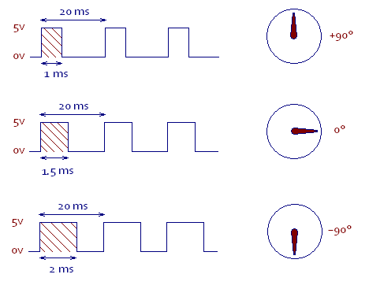

Hobby Servo Motors
==================

Overview
--------

In this lesson you will learn how to drive a standard hobby servo motor. Hobby servo motors are designed primarily for controlling the direction of remote control boats, aircraft and cars. The include gear reduction and their own internal drive circuitry making them easy to control directly from a microcontroller.

Hobby servo motors are positioning motors and can only rotate approximately 180 degrees. They can be set to an exact position based on a control signal that can be provided by your microcontroller.  

Servo Connections
-----------------

The three wires from your servo motor are color coded orange, red and brown. The red wire provides power to the servo motor and internal circuitry. The brown wire is the ground lead. The orange wire is for the control signal that drives the motor to the specified position.

NOTE: Hobby servo motors draw more power than can be provided by your USB port. In order to drive the hobby servo motor you will need to connect their power pin to a separate supply such as your bench supply.

IMPORTANT: DO NOT CONNECT YOUR BENCH SUPPLY TO THE POWER BUS OF YOUR BREADBOARD! You will use the bench supply power for the servo motor and your USB power for the breadboard and microcontroller. Servos can run on voltage up to 6 volts, but anything more than 5.5V will destroy your microcontroller.

Exercise
~~~~~~~~

#. Turn off your power supply and turn the voltage to zero.
#. Connect the three pin servo header to your breadboard.
#. Connect the brown wire to the ground bus of your breadboard.
#. Connect the red wire DIRECTLY to your power supply. DO NOT connect this wire to the power bus of your breadboard (see above.)
#. Turn on the supply and set the voltage to 6 volts
#. Connect the orange wire to one of the digital pins on your microcontroller.

TEACHER CHECK \_\_\_\_

Servo Pulse
-----------

As mentioned above, hobby servo motors can be controlled directly from a microcontroller pin. To control a servo motor you must provide a pulse every 20 ms and the pulse must be between 1ms and 2ms. The length of the pulse determines how much the servo will turn or more precisely, the angle of the servo motor shaft. As shown below a 1ms pulse will turn the motor shaft to the 90 degree position and a 2ms pulse will turn the motor shaft to a -90 degree position.

NOTE: This diagram is not proportionally correct. The 20ms should be much longer as compared with the 1ms

Exercise:
~~~~~~~~~

In this first exercise, you will simply set the move to move to a single position.

#.  Add a servo horn to your servo motor if it does not already have one.
#.  Place a piece of tape on one of the arms of the servo horn so that you can determine which what the servo horn is pointing.
#.  Write a program to drive your servo to its mid position (1.5ms). To do this, you will need to create a pulse with an overall period of approximately 20ms (this does not have to be exact). The ON portion of the pulse will need to be 1.5ms. NOTE: The delay function cannot accept fractional numbers so you will need to use delayMicroseconds for the ON pulse and you will need to convert 1.5 milliseconds to microseconds!
#.   Turn off power to your servo motor (from the power supply).
#.  Physically turn your servo horn to all the way in either direction (till it stops).
#.  Turn on power to your servo motor.
#.  Download your code and your servo should move to its center position.
#.  Set up your scope to measure and confirm the length of pulse and space between pulses.
#.  Change the pulse to length of 1ms (1000us) and confirm the position of the servo arm moves to one side of the center.
#. Change the pulse to length of 2ms (2000us) and confirm the position of the servo arm moves to the other side of the center.

        TEACHER CHECK \_\_\_\_

In this second exercise, you will use the servo commands from the Arduino library instead of creating the pulse with delays. The code from the Arduino library will completely replace the code you have just written and create pulses without having to use delay routines.

#. Create a new code file.
#. Start by placing the following at the top of your code file in order to use the servo library.

.. code-block:: C

   #include <Servo.h>

#. Just below the line above you will need to create a servo object using the following command. NOTE: You can change myservo to any name for the servo object.

.. code-block::

   Servo myservo;

#. In your setup function. you will need to use the following code to  attach the servo to a pin. In the following example the servo is attached to pin 9.

.. code-block::

   myservo.attach(9);

#. In your loop function you can now use the following command to drive your servo motor. In the following example the servo is being driven to position 10 degrees from the start position. NOTE: The servo range is from 0 to 180.

.. code-block::

   myservo.write(10);

#. In your loop function, add three write commands to drive the servo to three different locations. Include a one second delay between each
   servo position command.
#. Download your code and demonstrate it for your teacher. 

TEACHER CHECK \_\_\_\_

8. Set the three positions of 0 degrees, 90 degrees and 180 degrees.
   Confirm that the servo horn turns the correct number of degrees.

Challenge
~~~~~~~~~

1. Add a potentiometer to your circuit and modify your program so that
   you can use a potentiometer to control the length of your pulse
   between 1ms and 2ms. You will need to scale the range of the
   potentiometer so that turning fully in one direction corresponds to a
   1ms pulse and turning fully in the other direction corresponds to a
   2ms delay. Again use your scope to display your pulse.
2. When you turn your potentiometer, does it turn the same direction as
   the servo? If not, modify your code so that it does.

TEACHER CHECK \_\_\_\_
