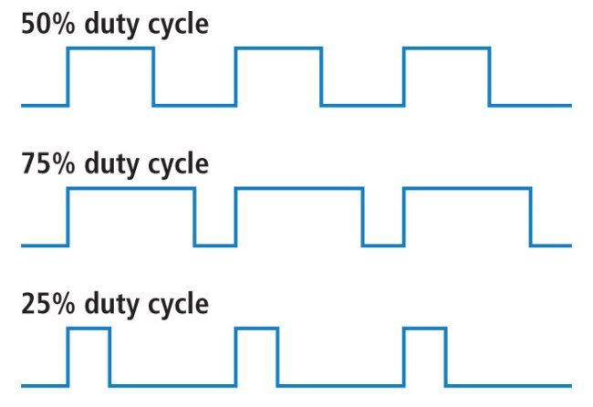

Duty Cycle
==========

Overview
--------

In this lesson you will learn about pulse width modulation (PWM) and how to use PWM to control the brightness of lights or the speed of a motor. PWM is, as the name states, a way to control the width of a pulse. By controlling the width of a pulse you can the percentage of time the pulse is high and low and as a result control the power provided to a circuit. Note that you also used pulse width modulation to control your servo motor.

The amount of time a pulse is on versus off is called the **duty cycle**. The duty cycle is a measure of the percentage of time a pulse is on versus off.  In the diagram below the first pulse is on for exactly the same time it is off (i.e. 50 percent on and 50 percent off). This is known as a 50 percent duty cycle. If this pulse were driving a light, the light would be half as bright as its maximum brightness. The greater the duty cycle, the more power, light or speed is generated in the device.

Exercise
~~~~~~~~

#. Complete the following table.

   **Period**: The period of a wave is simply the sum of the OFF time and ON time.
   **Duty Cycle**: The duty cycle is the ratio of ON time to total time. In order to calculate duty cycle, divide the ON time by the period of your pulse and multiply your answer by 100.
   **Frequency**: Frequency is the inverse of period. The units for frequency are Hz which is measured in cycles (period) per second. Make sure to use the correct units.

+--------+---------+------------------+----------+------------------+------------------+
| On     | Off     | Period (in ms or | Duty     | Period (in       | Frequency (in    |
| Time   | Time    | us)              | Cycle    | seconds)         | Hertz)           |
+--------+---------+------------------+----------+------------------+------------------+
| 2ms    | 15ms    |      17ms        |  12%     |  .017s           |     59Hz         |
+--------+---------+------------------+----------+------------------+------------------+
| 5ms    | 5ms     |                  |          |                  |                  |
+--------+---------+------------------+----------+------------------+------------------+
| 350us  | 50us    |                  |          |                  |                  |
+--------+---------+------------------+----------+------------------+------------------+
| 12us   | 50us    |                  |          |                  |                  |
+--------+---------+------------------+----------+------------------+------------------+

TEACHER CHECK \_\_\_\_

2. Demonstrate the third wave listed in the table above on your scope.

TEACHER CHECK \_\_\_\_

3. Add an LED and potentiometer to your board. Control the brightness of the LED using PWM. Your PWM should be created with a simple loop of digitalWrite and delays. Note that the overall delay needs to be low enough that the LED does not appear to flash.
