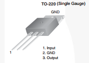
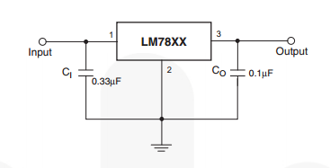

# Analogwrite

## Overview

In addition to creating a PWM signal using delays, you can set up a PWM signal using the analogWrite command which runs a pulse in the background of your code. This is a very useful function because it does not tie up your code looping through delay routines.

The function takes two arguments. The first argument is the pin number on your device and the second is a value that corresponds to the duty cycle of the pulse.

The pin is the pin number that will produce the PWM signal. NOTE that this function ONLY works on pins 3, 5, 6, 9, 10, and 11. The value determines the duty cycle or width of the pulse. The range of values is 0 to 255. A value of 255 is a 100% duty cycle (or full on) and a value of 0 is 0% duty cycle (or is full off). A value of 128 is a 50% duty cycle or half on and half off.

### Exercise

1.  Calculate the value required to create a 75% duty cycle using the analogWrite command.

                Value = \_\_\_\_\_\_\_\_\_\_\_\_\_

2.  Write a program that produces a pulse with a 75% duty cycle. Place the analogWrite command in the set-up function and not in the loop function to demonstrate that you do not need to repeatedly call this command.

<!-- end list -->

3.  Using your oscilloscope measure the width of the HIGH and LOW portions of the pulse.

<!-- end list -->

1.  Length of HIGH pulse: \_\_\_\_\_\_\_\_\_\_\_\_\_

<!-- end list -->

2.  Length of LOW pulse: \_\_\_\_\_\_\_\_\_\_\_\_\_

TEACHER CHECK \_\_\_\_

### Challenge

Design a circuit that can be used to control the brightness of an LED with a potentiometer.

TEACHER CHECK \_\_\_\_

 VOLTAGE REGULATION

## Overview

Almost every circuit you design will need some sort of voltage regulation. Most integrated circuits are designed to work within a narrow voltage range and almost all circuits require a voltage that is stable. Logic circuits typically work at either 5.0V, 3.3V or 1.8V. Almost all of the circuits you will create in this class will run on either 5.0V or 3.3V

## USB Power

Small logic devices that do not require much power can be driven by the power from the USB port. The USB port provides 5V for circuits but is limited to about 500mA. This is how your USB port is able to charge your phone.

### Exercise:

Using a multimeter, measure the voltage on your  USB hub. You will need to connect a programming cable to your hub and measure the voltage at the working end of the programming cable.

## Linear regulators

Linear regulators are low cost and easy to use voltage regulators. The downside is that they are not very efficient wasting a lot of power.

## LM7805

The LM7805 is a common regulator for producing 5 volts for your circuit. It is cable of driving 1A of current. The LM7805 is capable of converting input voltages from 6V to 12V to an regulated output of 5V

### Exercise:

Using the device diagram and the basic circuit shown below, set up an LM7805 to regulate 10V input from your bench supply to 5V output. NOTE: You will not need to use the capacitors shown for this exercise. Test your output using a multimeter. NOTE: your circuit may not produce exactly 5.0V.

Device Diagram

Basic Circuit

TEACHER CHECK \_\_\_\_

## LD33V

The LD33V is a linear regulator that has a fixed output of 3.3V.

### Exercise:

Set up a circuit using the LD33V to regulate and input voltage of 8.0V to 3.3V. You will need to look up the datasheet for the LD33V in order to design the circuit.  IMPORTANT\! The LD33V does NOT have the same pinout as the LM7805.
