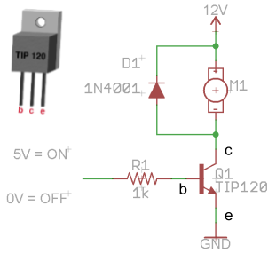
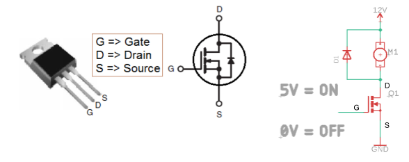
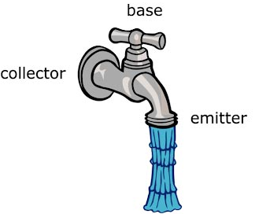
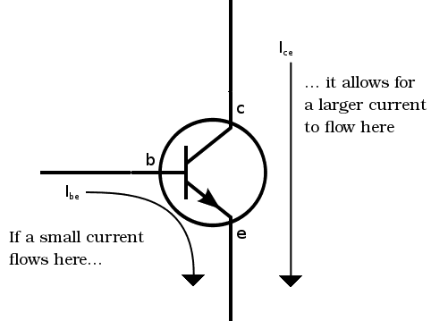

Motor Driver
============

Overview
--------

In this lesson you will learn how to drive a small DC motor using a
transistor. It is important to note that you CANNOT drive a DC motor
directly from a microcontroller. The digital pins on your
microcontroller pins can only provide about 20mA of current. This is
enough to drive an LED and nothing more powerful. Even a small DC motor
will draw at least 50mA of current. Using a pin on your microcontroller
to drive more than 20mA of current will permanently damage your
microcontroller.

In addition motors can often require 12 volts or more. Your
microcontroller will be damaged if its supply voltage goes over 5.5V.
When setting up circuits to control motors, you will often need to set
up two voltages on your board.

Direct Drive
------------

In this initial step, you will be driving the motor directly from your
bench power supply.

Exercise
~~~~~~~~

1. IMPORTANT Follow these steps carefully. Check with you teacher if you
   have concerns.

.. raw:: html

   <!-- end list -->

1. Make sure your bench supply is turned off!
2. Make sure the voltage on your bench supply is turned to zero!
3. DO NOT turn your voltage above 12 Volts when driving the motor or you
   will damage the motor and you will need to buy me a new one!

.. raw:: html

   <!-- end list -->

2. Connect your bench power supply to your motor. The motor is not
   polarized so you can connect either motor lead to either supply lead.
3. Turn on your bench supply and turn the voltage up to 6 volts and then
   12 volts. Record the current draw at each voltage. You can use the
   bench supply to measure the current.

                Current draw at 6 Volts: \_\_\_\_\_\_\_\_\_\_\_\_\_\_

                Current draw at 12 Volts: \_\_\_\_\_\_\_\_\_\_\_\_\_\_

TEACHER CHECK \_\_\_\_

Transistor Drive
----------------

In order to drive your motor using a low current control signal, you
will need to add a transistor to your circuit. A transistor is a device
that allows you to drive a large amount of current with a small amount
of current.

Below is a diagram of a transistor. A large amount of current (like that
required to drive a motor) can flow from C (collector) to E (emitter).
The large current can be turned on and off at B (base) using a small
amount of current.

|image0|\ |image1|

The image on the right shows how a faucet can be a model for a
transistor, with a large amount of current flowing through the faucet.
The handel (or base) can be used to easily turn on and off this current.

Exercise
~~~~~~~~

1. Turn OFF your power supply and make sure the voltage is turned to
   zero!
2. Design the circuit shown below on your breadboard. You should use
   alligator clip leads to connect your motor to the breadboard and the
   power supply. A long flexible jump wire should be attached to the
   unconnected end of the resistor. This will be used to turn the motor
   on and off.
3. You will need 5V on your board to control the transistor.  A good
   option is to add a Metromini to your board and connect both 5V and
   GND to the rails of the breadboard.

TEACHER CHECK \_\_\_\_

4. Turn on the power supply.
5. Turn the voltage to 6 Volts.
6. Drive your motor by connecting the control line (the base) to 5V.
7. Turn off your motor by connecting the control line to 0V.
8. Turn the voltage up to 12 Volts to drive the motor faster. DO NOT go
   above 12 Volts.
9. Record the current draw of the motor at 12 Volts:
   \_\_\_\_\_\_\_\_\_\_\_\_\_\_\_\_

TEACHER CHECK \_\_\_\_

Challenge:
~~~~~~~~~~

Rewire the circuit to reverse the direction of the motor.

MOSFET Drive
------------

Using a MOSFET to drive your motor is very similar to using a
transistor. The difference is that the MOSFET is a voltage driven device
and the transistor is a current driven device. For this reason, the
MOSFET does not need a resistor.

TEACHER CHECK \_\_\_\_

MCU Drive
---------

Now that you have confirmed that you can turn your motor on and off
using the same logic level that is used to control your MCU, you should
be able to directly drive your transistor using your microcontroller.

Exercise
~~~~~~~~

Connect the control line of your transistor to your microcontroller.
Write a program to repeatedly turn your motor on for three seconds and
off three seconds.

TEACHER CHECK \_\_\_\_

