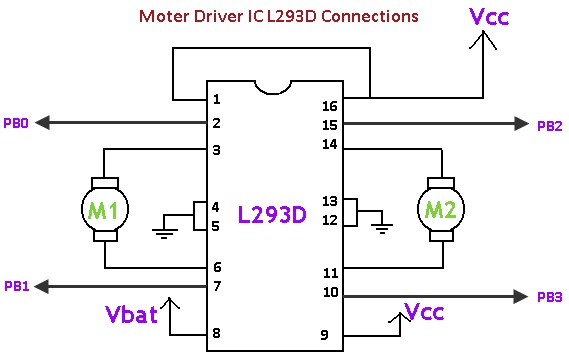
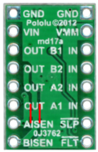

# Motor Control Modules And Ics

## Overview

Since setting up bi-directional motor control using discrete components is difficult there are huge variety of motor control modules and integrated circuits. Many of these devices work in a similar manner so knowing how to use the ones included here will make it easy for you to learn how to use just about any motor module.

## Current Rating

One of the most important features of a motor control module is the current rating. This the amount of current that the motor driver can handle. For example, if you motor draws up to 2 Amps of current than you will need a motor driver that can handle more than 2 Amps of current. Generally, the more current a motor driver can handle the more expensive it is.

## L293D OR SN754410NE

The L293D or similar SN764410NE are the only motor driver ICs that we will cover. They are dual motor drivers meaning that each IC can drive two motors and they can handle about 600 mA per motor.

Below is a simple hook up diagram for the L293D. Vcc is the logic voltage or 5 Volts. Vbat is the supply you will use to control your motor. IMPORTANT: You should NOT drive your motor using Vcc or the same supply as you are using for your logic.

There are two control lines for each motor. PB0, PB1 for the motor on the left and PB2, PB3 for the motor on the right. Below is a table showing how the control lines drive each motor.

|      |      |                        |
| ---- | ---- | ---------------------- |
| PB0  | PB1  | Function               |
| HIGH | HIGH | Brake                  |
| HIGH | LOW  | Turn Clockwise         |
| LOW  | HIGH | Turn Counter-Clockwise |
| LOW  | LOW  | Brake                  |

### Exercise:

Set up the L293D (or SN745510NE) to drive a single motor in two directions. You should NOT use a microcontroller to complete this exercise. (i.e. just set the inputs into power and ground)

IMPORTANT: If you plan to use an Arduino Uno to control the motor module, consult the guide on using [Arduino and Power Control.](https://www.google.com/url?q=https://docs.google.com/document/d/1BmZbXzxnD2j17QToSZ9jeZmnP7burwfksfQq2v4zu-Y/edit%23heading%3Dh.po3whfrs5bxa&sa=D&ust=1587613174167000)

TEACHER CHECK \_\_\_\_

## MD17A

The MD17A is a small dual motor control module made by Pololu and based on the DRV8833 motor driver IC. Below is a diagram of the motor module and a table describing the proper connections for your board.

|                       |                                                    |
| --------------------- | -------------------------------------------------- |
| Pin Name              | Pin Function                                       |
| GND                   | Connect to ground on your breadboard               |
| VIN                   | Connect to power from power supply to drive motors |
| OUT (B1) and OUT (B2) | Drive for motor B (connect two wires from motor)   |
| OUT (A1) and OUT (A2) | Drive for motor A (connect two wires from motor)   |
| AISEN                 | Not connected                                      |
| BISEN                 | Not connected                                      |
| VMM                   | Not connected                                      |
| IN (B1) and IN (B2)   | Logic control for motor B                          |
| IN (A1) and IN (A2)   | Logic control for motor A                          |
| SLP                   | Not connected                                      |
| FLT                   | Not connected                                      |

### Exercise:

Set up your breadboard with the MD17A following the table for making connections. Use long flexible jump wires for each of four pins labeled IN (logic inputs). These should be from the pins labeled IN to ground on your breadboard.

TEACHER CHECK \_\_\_\_

### Exercise:

Demonstrate how you can control the direction and power to each motor using the logic inputs (IN).

TEACHER CHECK \_\_\_\_

### Exercise:

Connect the four logic inputs to four digital ports on your MetroMini. Write a program to turn drive each motor on for 3 seconds, reverse direction for 3 seconds and off for 3 seconds.

TEACHER CHECK \_\_\_\_
