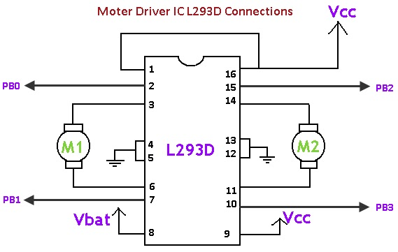

Motor Control Modules
=============================

Overview
--------

L293D OR SN754410NE
-------------------

The L293D or similar SN764410NE are the only motor driver ICs that we
will cover. They are dual motor drivers meaning that each IC can drive
two motors and they can handle about 600 mA per motor.

Below is a simple hook up diagram for the L293D. Vcc is the logic
voltage or 5 Volts. Vbat is the supply you will use to control your
motor. IMPORTANT: You should NOT drive your motor using Vcc or the same
supply as you are using for your logic.

There are two control lines for each motor. PB0, PB1 for the motor on
the left and PB2, PB3 for the motor on the right. Below is a table
showing how the control lines drive each motor.

+--------+--------+--------------------------+
| PB0    | PB1    | Function                 |
+--------+--------+--------------------------+
| HIGH   | HIGH   | Brake                    |
+--------+--------+--------------------------+
| HIGH   | LOW    | Turn Clockwise           |
+--------+--------+--------------------------+
| LOW    | HIGH   | Turn Counter-Clockwise   |
+--------+--------+--------------------------+
| LOW    | LOW    | Brake                    |
+--------+--------+--------------------------+

Exercise:
~~~~~~~~~

Set up the L293D (or SN745510NE) to drive a single motor in two
directions. You should NOT use a microcontroller to complete this
exercise. (i.e. just set the inputs into power and ground)

IMPORTANT: If you plan to use an Arduino Uno to control the motor
module, consult the guide on using `Arduino and Power
Control. <https://www.google.com/url?q=https://docs.google.com/document/d/1BmZbXzxnD2j17QToSZ9jeZmnP7burwfksfQq2v4zu-Y/edit%23heading%3Dh.po3whfrs5bxa&sa=D&ust=1587613174167000>`__

TEACHER CHECK \_\_\_\_

MD17A
-----

The MD17A is a small dual motor control module made by Pololu and based
on the DRV8833 motor driver IC. Below is a diagram of the motor module
and a table describing the proper connections for your board.

.. figure:: images/image28.png
   :alt: 

+-------------------------+------------------------------------------------------+
| Pin Name                | Pin Function                                         |
+-------------------------+------------------------------------------------------+
| GND                     | Connect to ground on your breadboard                 |
+-------------------------+------------------------------------------------------+
| VIN                     | Connect to power from power supply to drive motors   |
+-------------------------+------------------------------------------------------+
| OUT (B1) and OUT (B2)   | Drive for motor B (connect two wires from motor)     |
+-------------------------+------------------------------------------------------+
| OUT (A1) and OUT (A2)   | Drive for motor A (connect two wires from motor)     |
+-------------------------+------------------------------------------------------+
| AISEN                   | Not connected                                        |
+-------------------------+------------------------------------------------------+
| BISEN                   | Not connected                                        |
+-------------------------+------------------------------------------------------+
| VMM                     | Not connected                                        |
+-------------------------+------------------------------------------------------+
| IN (B1) and IN (B2)     | Logic control for motor B                            |
+-------------------------+------------------------------------------------------+
| IN (A1) and IN (A2)     | Logic control for motor A                            |
+-------------------------+------------------------------------------------------+
| SLP                     | Not connected                                        |
+-------------------------+------------------------------------------------------+
| FLT                     | Not connected                                        |
+-------------------------+------------------------------------------------------+

Exercise:
~~~~~~~~~

Set up your breadboard with the MD17A following the table for making
connections. Use long flexible jump wires for each of four pins labeled
IN (logic inputs). These should be from the pins labeled IN to ground on
your breadboard.

TEACHER CHECK \_\_\_\_

Exercise:
~~~~~~~~~

Demonstrate how you can control the direction and power to each motor
using the logic inputs (IN).

TEACHER CHECK \_\_\_\_

Exercise:
~~~~~~~~~

Connect the four logic inputs to four digital ports on your MetroMini.
Write a program to turn drive each motor on for 3 seconds, reverse
direction for 3 seconds and off for 3 seconds.

TEACHER CHECK \_\_\_\_
