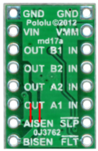

MD17A
=============================

Overview
--------

The MD17A is a small dual motor control module made by Pololu and based on the DRV8833 motor driver IC. The following are features of this motor module. You can find more information about the module on the Pololu site `here <https://www.pololu.com/product/2130>`__. 

- Dual-H-bridge motor driver: can drive two DC motors or one bipolar stepper motor
- Operating voltage: 2.7‌‌ V to 10.8 V
- Output current: 1.2 A continuous (2 A peak) per motor
- Motor outputs can be paralleled to deliver 2.4 A continuous (4 A peak) to a single motor
- Inputs are 3V- and 5V-compatible
- Under-voltage lockout and protection against over-current and over-temperature
- Reverse-voltage protection circuit
- Current limiting can be enabled by adding sense resistors (not included)

   
Pin Diagram
------------
The following table lists the functions of each pin as shown in the image above.

+-------------------------+------------------------------------------------------+
| **Pin Name**            | **Pin Function**                                     |
+-------------------------+------------------------------------------------------+
| GND                     | Connect to ground on your breadboard                 |
+-------------------------+------------------------------------------------------+
| VIN                     | Connect to power from power supply to drive motors   |
+-------------------------+------------------------------------------------------+
| OUT (B1) and OUT (B2)   | Drive for motor B (connect two wires from motor)     |
+-------------------------+------------------------------------------------------+
| OUT (A1) and OUT (A2)   | Drive for motor A (connect two wires from motor)     |
+-------------------------+------------------------------------------------------+
| AISEN                   | Not connected                                        |
+-------------------------+------------------------------------------------------+
| BISEN                   | Not connected                                        |
+-------------------------+------------------------------------------------------+
| VMM                     | Not connected                                        |
+-------------------------+------------------------------------------------------+
| IN (B1) and IN (B2)     | Logic control for motor B                            |
+-------------------------+------------------------------------------------------+
| IN (A1) and IN (A2)     | Logic control for motor A                            |
+-------------------------+------------------------------------------------------+
| SLP                     | Not connected                                        |
+-------------------------+------------------------------------------------------+
| FLT                     | Not connected                                        |
+-------------------------+------------------------------------------------------+

Hook Up Diagram
----------------
The following is a hook up diagram for using the MD17A. Note that generally it is best to solder and use the MD17A with the label side up so it is easier to make sure your connections are correct. **VERY IMPORTANT** The MD17A only has one voltage input. This is for the power to the motor. This voltage should ONLY be applied to this pin and no where else on your board.

.. image:: images/MD17a.png

Control Logic
--------------
The following table describes the control logic for the MD17A. By applying HIGH (5V) and LOW (0V) signals to the inputs you can change the direction of the motor. Note that the use of clockwise and counterclockwise is arbitrary. These merely indicate a change in direction of the motor.

.. list-table:: **Control Logic**
   :widths: 25 25 25
   :header-rows: 1

   * - IN1
     - IN2
     - Direction
     
   * - HIGH
     - LOW
     - Clockwise
     
   * - LOW
     - HIGH
     - Counterclockwise
   * - LOW
     - LOW
     - Break
   * - HIGH
     - HIGH
     - Break

Exercise:
~~~~~~~~~

#. Set up your breadboard with the MD17A following the table for making connections for one motor. 
    * Connect GND to the ground on your breadboard. 
    * Connect the red lead on your bench supply to VIN. (NOT TO THE RED BUS ON YOUR BREADBOARD)
    * Connect the black lead on your bench supply to the ground bus on your breadboard.
    * Connect your motor leads to AOUT1 and AOUT2. The order does not matter.
    * Connect a long jump wire to each INA1 and INA2. 
    
#. Using the long jump wires connected to INA1 and INA2 control the direction of your motor. Note that you will need to have power and ground bus of your breadboard set to 5v and 0V respectively. You can do this using your Metro Mini, Arduino Uno or the bench supply.

#. Add a Metro Mini or Uno to your breadboard and now control the motor in software. Note that HIGH in software is equivalent to the 5V on your breadboard. Write a program to drive your motor clockwise for 3 seconds and the counterclockwise for 3 seconds.
 

