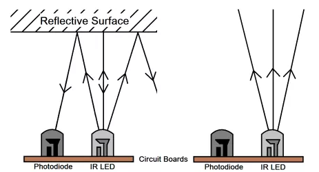
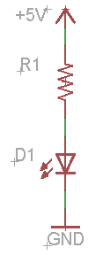

# Overview

Photo reflector pairs are commonly used in all sorts of applications from sensing the amount of paper in a printer to tracking the rotation of a mouse wheel.

A photo reflector sensor contains two parts: one part emits light and the other detects light. The diagram below shows a reflective configuration (the IR LED emits infrared light and the photodiode senses infrared light.) In this configuration, the sensor can be used to detect the presence or absence of a near object.

NOTE: Most surfaces offer some reflectivity though the surface needs to be fairly close to the sensor. Basic photoelectric sensors have a maximum range of less than 5mm.

All phototransistors are designed to be sensitive to a specific wavelength of light. The most common phototransistors are designed to be sensitive to a wavelengths in the infrared (IR) spectrum. When building a photosensor circuit, It is important to make sure that your LED also emits light in a similar wavelength. For example, if your phototransistor is sensitive to a wavelength of 800nm than you should select an LED that emits at 800nm.

# IR Photo Emitter

In this first part of the project you will build the photo emitter circuit. The photo emitter is a simple LED designed to emit infrared light. You will be using an LTE-4208 IR emitter made by Lite-On Inc. You can find the datasheet by searching for “LTE-4208 and Datasheet”. Use the datasheet to answer the following questions.

### Exercise:

Construct the IR emitter circuit as shown below. Using the LTE-4208 as the emitter select the correct resistor to drive it at approximately 20mA.

 TEACHER CHECK \_\_\_\_

# IR Photo-sensor

In this second part of the project, you will build the photosensor circuit. You will be using the LTR-3208E as your phototransistor. The diagram below shows a schematic for a sensor circuit using an phototransistor. The flow of current through this circuit is determined by the amount of infrared light striking the surface of the phototransistor. This light is represented by the two arrows. The more infrared light that strikes the phototransistor the more the current flows.

As current flows through the circuit the voltage potential at Voltage Out drops. This way the voltage at Voltage Out can be used to determine how much light is striking the phototransistor.

### Exercise

Set up the photosensor circuit as shown above using a 10K resistor for R6. Crimp two 2-wire extensions that are at least eight inches long. Connect both your IR LED and IR phototransistor to the board using these connectors. This will allow you to easily position your emitter and sensor. Use the red and black wire with black going to the ground on your board.

Place a your multimeter in the circuit to measure the voltage between collector of the phototransistor and ground. This is labeled as Voltage Out in your circuit. Answer the following questions:

1.  What is the voltage under ambient light?  Ambient light is the normal light in your classroom. Note that florescent lights and white LEDs produce little infrared light. Note: Make sure your infrared LED is not being powered for this step.

<!-- end list -->

2.  What is the voltage in the direct path of the emitter? (i.e. when the infrared emitter is pointed directly at the infrared sensor)

<!-- end list -->

3.  How far way away can you place the emitter and sensor and still measure less than one volt?

4.  Place the emitter and sensor about three inches apart and facing each other. Keeping the emitter about three inches from the sensor move it in an arc until the voltage drops below 3.5V. What is the angle.

5.  Hold the sensor and emitter side by side and both facing in the same direction. What is the voltage?

6.  Keeping the emitter and sensor side by side, move the sensor and emitter far enough apart so that the voltage rises above 4.5V. What is this distance?
7.  With the emitter and sensor at this distance apart place a white card one foot in front of the sensors. Now move the card closer to the sensors in inch increments and measure the voltage and record in the charge below.

