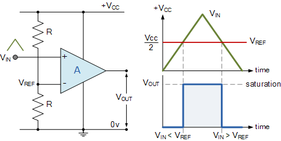
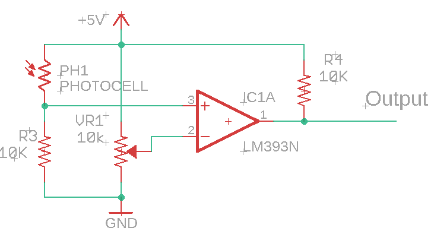

Comparator
==========

Overview
--------

Comparators provide a way to set a threshold voltage for reading an
analog signal. The diagram below shows an example comparator circuit
with the comparator labeled A. The comparator has two inputs. One input
is the reference which sets the threshold value in volts. The threshold
voltage in the circuit below is on the - (minus) pin of the comparator
and is created with a voltage divider. The second input is the voltage
being measured or compared. The comparator has one output. The output is
either HIGH or LOW based on the comparison between the voltage reference
input and the input voltage being measured.

For example, if the voltage reference is set at 4 volts and the Vcc or
circuit voltage is 5 volts than if the measured voltage goes higher than
4 volts the output of the comparator will be HIGH. If the voltage input
is below 4 volts the output will be LOW.

Below on the right is a diagram show the resulting voltage output from
the comparator. Note that when Vin is below the Vref the voltage output
Vout is LOW and when the Vin is above the Vref the Vout is HIGH.

A common comparator IC is the
`LM393 <https://www.google.com/url?q=http://www.ti.com/lit/ds/symlink/lm393-n.pdf&sa=D&ust=1587613174310000>`__
which has four internal comparators.

Exercise:
~~~~~~~~~

Construct the following circuit. Note that in the schematic power and
ground for the LM393 are not included. You will need to look on the data
sheet for which pins are used for power and ground. These pins need to
be connected. Once you have completed this circuit show your teacher.

 TEACHER CHECK \_\_\_\_

Now follow the steps shown below to set up the circuit to trigger on a
specific light level.

1. Connect a meter to the output of the LM393 and set it read voltage.
2. Adjust the potentiometer so that it produces 3.5V on Vref.
3. Determine how far your hand needs to be from the photoresistor to
   trigger the comparator.

|image0|
^^^^^^^^

 TEACHER CHECK \_\_\_\_

