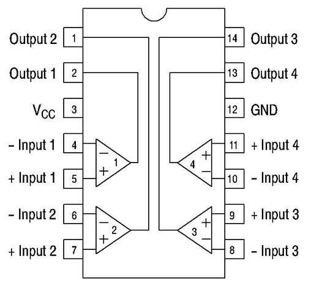
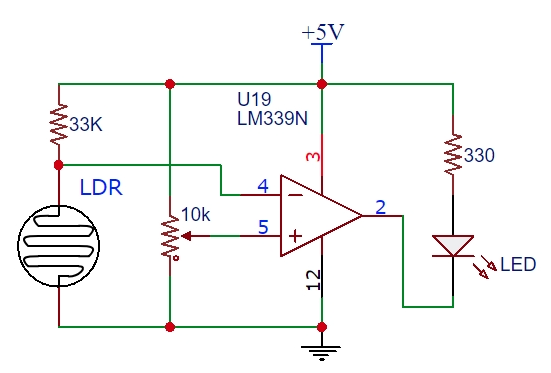

Comparator One
==========

Overview
--------

Comparators provide a way to set a threshold voltage for reading an analog signal. The diagram below shows an example comparator. The inputs are labeled Vi and Vref, and the output is labeled Vo. The pins +Vcc and -Vee are just for powering the comparitor. 

.. figure:: images/basiccomparator.PNG
   :width: 400
   :alt:

The comparator is designed to produce a high signal (i.e. 5V) whenever the voltage on Vi is above the voltage on Vref. This way, depending on the voltage on Vref, you can detect a specific voltage on Vi. For example, if you set Vref to 3V you could detect every time Vi exceeded 3V. 

Below is the pin diagram for an LM339. The LM339 used in the circuit above, is a quad comparator. It is designated "quad" because there are four comparators in the circuit. Note that each comparator has two inputs and one output. The IC can be powered with 5 V. 

Exercise
--------

#. Place an LM399 on your breadboard.
#. Connect VCC (pin 3) to power.
#. Connect GND (pin 12) to ground.

The following circuit shows a compartor being used in circuit. Note that the Vref is being controlled by a potentiometer. This way, it is easy to set the threshold voltage to any value between 0 V and 5 V. In this circuit the Vi is being controlled by a resistive light sensor as you have seen in previous lessons. The voltage on Vi changes depending on the amount of light that falls on the sensor. The Vo is tied to an LED, so you can easily and visually determine if the threshold voltage has been tripped. 

   

   
Exercise
--------

#. Construct the circuit shown above using an LM339. 

#. Adjust the potentiomater so that the LED turns on when the sensor is in bright light.

#. Now set up circuit so that the LED turns on when the sensor is in the dark. You can do this by swaping the the Vi (or -) input with the Vref (or +) input. 

#. Connect Vo of your circuit to a digital pin on your microcontroler. Do not remove the LED part of the circuit. This will be useful for confirming if your software is working correctly. 

#. Write a program to that displays the word "light" in your serial monitor when the sensor detects a bright light and "dark" when the sensor does not detect a bright light.

