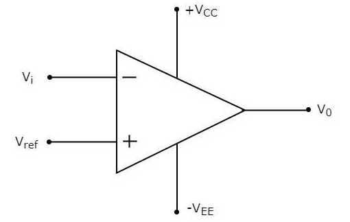

Comparator One
==========

Overview
--------

Comparators provide a way to set a threshold voltage for reading an analog signal. The diagram below shows an example comparator. The inputs are labeled Vi and Vref, and the output is labeled Vo. The pins +Vcc and -Vee are just for powering the comparitor. 

The comparator is designed to produce a high signal (i.e. 5V) whenever the voltage on Vi is above the voltage on Vref. This way, depending on the voltage on Vref, you can detect a specific voltage on Vi. For example, if you set Vref to 3V you could detect every time Vi exceeded 3V. 

Below is the pin diagram for an LM339. The LM339 used in the circuit above, is a quad comparator. It is designated "quad" because there are four comparators in the circuit. Note that each comparator has two inputs and one output. The IC can be powered with 5 V. 

.. figure:: images/LM339pinout.PNG
   :width: 400
   :alt:

Below is a schematic showing the LM339 using two potentiomenters as inputs. 

.. figure:: images/lm339withpot.PNG
   :width: 600
   :alt:

Exercise
--------
#. Complete the schematic shown above.
#. Place an LM399 on your breadboard.
#. Connect VCC (pin 3) to power.
#. Connect GND (pin 12) to ground.
#. Connect Output 1 (pin 2) to a digital pin on your MetroMini.
#. Write a program to read that pin and display the value in your serial monitor.
#. Set up two potentiometers on your breadboard as shown above.
#. Using a multimeter set one of the potentiometers output to around 2.5V. 
#. Turn the other potentiometer and the value on your serial monitor should change when the second potentiometer goes above or below 2.5V.
#. Confirm this by measuring the voltage on the output of your second potentiometer.

