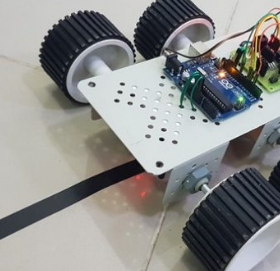
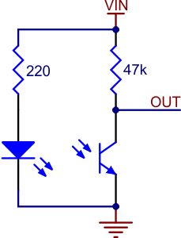

# Photo Reflector Module

## Overview

In this lesson, you will learn how to use an infrared (IR) reflective sensor to distinguish between light and dark areas. Specifically, these sensors are used to detect lines for line tracking robots and to count lines on rotary encoders as shown below.

Line tracking robot                                Rotary wheel encoder

The QTR-1A sensors (shown below) include a photo emitter and sensor pair as well as other necessary components. The schematic for the sensor is shown below as well. On the left side of the schematic is the IR emitter which sends out infrared light. On the right of the schematic is the phototransistor which senses infrared light. The voltage at the OUT pin varies depending on how much infrared light is reflected from the IR emitter.

QTR-1A Sensor                        QTR-1A Schematic

# Setup

In order to accurately test this sensor, you will need to create a sensor mount, a connector cable and a test card. The sensor mount should hold the sensor at a fixed height around 0.125” (3mm) above the table and allow you to easily pass the test card under the sensor. You can create this using cardboard and tape. Since the sensor will not be on your breadboard, you will also need to use flexible jump wires to connect it to your board. Finally, you will need to create a card for testing your sensor’s sensitivity to dark and light surfaces. This can be made simply from a white index card with a single black line made using a marker or tape.

 TEACHER CHECK \_\_\_\_

# Interface

There are three possible methods for reading the output from this sensor; analog, digital and comparator. Each method is described below and their pros and cons.

## Analog

Since this sensor produces an analog signal, you can read the output on any analog port which will provide a reading from 0 to 1023. Reading the value on an analog port provides an easy way to set and adjust the exact threshold for sensing a line. The downside of the using the analog port is that reading values is slow and you can not easily integrate an interrupt.

### 

### Exercise:

Connect the sensor mount to your breadboard using the three wire cable you created in the exercise above. Set the sensor on the table and place your test card under the sensor. Use a multimeter to measure the voltage at the output of the sensor. The voltage should vary depending on the whether the dark line or white card is under the sensor.

Lowest value: \_\_\_\_\_\_\_\_\_\_\_\_\_\_\_\_\_\_ Volts (white background)

Highest value: \_\_\_\_\_\_\_\_\_\_\_\_\_\_\_\_\_\_ Volts (black line)

 TEACHER CHECK \_\_\_\_

### Exercise:

Create a circuit that can detect if the sensor is over the white background or black line. Connect the output of the sensor to an analog port. Write a program that displays in the terminal window  the word “line” when the sensor is over the black line and “background” when the sensor is over the white background.

 TEACHER CHECK \_\_\_\_

## Digital

This method relies on the internal comparator on each of the digital pins. Since you can not adjust the threshold in software you must rely on setting the correct height to get the results you want. The advantage of this method is that it is fast and can be used with interrupts.

### Exercise:

Repeat the last exercise, but move the output from an analog port to a digital port. You might need to adjust the height of your sensor so that it works correctly.

 TEACHER CHECK \_\_\_\_

Comparator

This is method provides the most accurate results and allows you to adjust easily for changes in ambient light or changes in the surface you are detecting. It also allows you to use interrupts in your code. The downside is that it requires a more complex circuit. Using what you learned in the section on comparators design a circuit that reads the output of the sensor. Include a potentiometer to set the reference voltage.

 TEACHER CHECK \_\_\_\_
