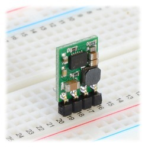
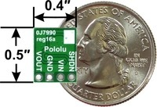

# Alphanumeric Led Display

## Overview

The four digit alphanumeric LED display allows you to easily display both numbers and letters on a bright LED display that can be seen from many feet away. You will note that it has 14 segments that allow it to display all of the letters and numbers. Also note that it displays upper case letters in a far more readable format than lower case.

## Set Up

Connect the alphanumeric display to your Metromini following the markings for the five pins on the upper portion of your display. Note that this device like many of the devices you have used communicates with your Metromini via I2C. A guide is provided below.

C: This is the clock pin for the I2C connection. It is often denoted as SCL on other devices.

D: This is the data pin for the I2C connection. It is often denoted as SDA on other devices.

\-: This the ground pin.

\+: The first + pin (next to the ground pin) is for Vcc or the voltage you are using on your board. Most likely 5 volts.

\+: The second + pin is for logic level for the I2C. This is in case you have a different logic level for your I2C connection from your voltage level. If your entire board is working 5 volts just connect this to the 5 volt rail as well.

## Program

Open the file, File/Examples/Adafruit LED Backpack/quadalphanum and program your device. You should see a demo set of characters display. Note that once the demo is complete, you can use your Serial Monitor to send text strings to the display.

 TEACHER CHECK \_\_\_\_

### Exercise:  (Challenging) 

Write a function for scrolling an text across your alphanumeric display. Your function should accept a string of text of various lengths and scroll the text across the display.

Note that in within the example code there is code for scrolling text from the serial port. You will need to isolate this code and move it into a separate function. Then you will need to learn how to pass a string to a function and how to iterate through that string.

## Switching Modules

Switching modules are modules designed around switching regulators. Switching regulators are much more efficient than linear regulators. The only disadvantage is that they are exclusively designed on surface mount technology, so we can only use them as modules.

## Reg16A

The Reg16A is a switching regulator module that you will be using in this class. The regulator comes in 3.3V version noted by the blue dot on back and 5.0V noted by the yellow dot on back.

The device has four pins as shown below. VIN is for the input voltage. GND is for ground and VOUT is the output voltage. SHDN is for shutdown and not generally necessary in your circuit. This device does not need any external components.

### Exericse:

Set up two Reg16a regulators on your breadboard. One for 3.3V and one for 5.0V. Drive both with an input of 12V and measure the output.

TEACHER CHECK \_\_\_\_

INTRO TO VERSION CONTROL

## Overview

Version control is required as a way to ensure that:

  - You can always retrieve a lost file.
  - You are working on your most recent file.
  - You can revert to a good working file.

Losing a file on your PC is file is very easy and can happen for many reasons including the following: (All of which are definitely not your fault, because you never do anything wrong)

1.  The power cord came out of my my computer and it crashed.
2.  I can’t find my files. I know they were here. Someone stole them.
3.  He is using my computer and won’t let me get my files.
4.  The computers got reformatted...what\!\!\!
5.  Don’t worry Mr. Christy, my files are securely stored on a thumb-drive that I have right here in my….hey have you seen my thumb-drive?

As shown in the diagram above, you can also pull your repository to another computer, such as you home computer. Make changes to your files. Commit them and then pull these changes down to your computer at school.

## Create Account

In this step, you will create an account on Github. Navigate to github.com using any browser. Create a user account following the directions provided. Do NOT use your school email address, because github will need to send you an email to confirm your account creation and your school email address will not accept email from outside the school domain. Additionally, you will use your github account long after you leave high school. Make sure to check your email and confirm you account creation.

## Create Repository

In this step, you will create a new remote repository on Github and an identical local repository on your computer. Files you stored in your local repository will be mirrored on your remote repository.

### Exercise:

1.  Setup

<!-- end list -->

1.  Launch Github Desktop from the start menu.
2.  Under File, select Options and confirm that you are logged into your git account.

<!-- end list -->

2.  New Repository

<!-- end list -->

1.  Under File, select New Repository.
2.  Enter a name for your repository. Write a name that relates to whatever you are working on i.e. buttons or LEDs.
3.  MAKE SURE to select Initialize this repository with a README.
4.  Select a local directory for your repositories. I recommend creating a folder under My Documents and named with your name in all caps.
5.  Select the Create repository button.

<!-- end list -->

3.  Use Repository

<!-- end list -->

1.  Open Arduino
2.  Save one of your code files to the directory you made above. The file path should resemble, My Documents/JOE/leds. Inside this directory you should see at least the following two files.

#### README.md

#### .gitattributes

4.  Update Changes

<!-- end list -->

1.  Return to Github Desktop. You should see the changed files listed.
2.  Enter a Summary. This is note about what you changed.
3.  Select Commit to Master
4.  Select Publish.

## Daily

Each day make sure to save your code and CAD files in your repository. At the end of the day, make sure to commit and publish all changes.
