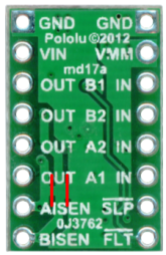

STEP ONE: Motor Control
=============================

Overview
--------

The MD17A is the default motor controller for the sumo robotics competition. This is a small dual motor control module made by Pololu and based on the DRV8833 motor driver IC. The following are features of this motor module. You can find more information about the module on the Pololu site `here <https://www.pololu.com/product/2130>`__. If you need to solder pins into your MD17A, please contact your teacher before soldering.

- Dual-H-bridge motor driver: can drive two DC motors or one bipolar stepper motor
- Operating voltage: 2.7‌‌ V to 10.8 V
- Output current: 1.2 A continuous (2 A peak) per motor
- Motor outputs can be paralleled to deliver 2.4 A continuous (4 A peak) to a single motor
- Inputs are 3V- and 5V-compatible
- Under-voltage lockout and protection against over-current and over-temperature
- Reverse-voltage protection circuit
- Current limiting can be enabled by adding sense resistors (not included)

   
Pin Diagram
------------
The following table lists the functions of each pin as shown in the image above.

+-------------------------+------------------------------------------------------+
| **Pin Name**            | **Pin Function**                                     |
+-------------------------+------------------------------------------------------+
| GND                     | Connect to ground on your breadboard                 |
+-------------------------+------------------------------------------------------+
| VIN                     | Connect to power from power supply to drive motors   |
+-------------------------+------------------------------------------------------+
| OUT (B1) and OUT (B2)   | Drive for motor B (connect two wires from motor)     |
+-------------------------+------------------------------------------------------+
| OUT (A1) and OUT (A2)   | Drive for motor A (connect two wires from motor)     |
+-------------------------+------------------------------------------------------+
| AISEN                   | Not connected                                        |
+-------------------------+------------------------------------------------------+
| BISEN                   | Not connected                                        |
+-------------------------+------------------------------------------------------+
| VMM                     | Not connected                                        |
+-------------------------+------------------------------------------------------+
| IN (B1) and IN (B2)     | Logic control for motor B                            |
+-------------------------+------------------------------------------------------+
| IN (A1) and IN (A2)     | Logic control for motor A                            |
+-------------------------+------------------------------------------------------+
| SLP                     | Not connected                                        |
+-------------------------+------------------------------------------------------+
| FLT                     | Not connected                                        |
+-------------------------+------------------------------------------------------+

Hook Up Diagram
----------------
The following is a hook up diagram for using the MD17A. **VERY IMPORTANT** The MD17A only has one voltage input. This is for the power to the motor. This voltage should ONLY be applied to this pin and no where else on your board.

.. image:: images/MD17a.png

Control Logic
--------------
The following table describes the control logic for the MD17A. By applying HIGH (5V) and LOW (0V) signals to the inputs you can change the direction of the motor. Note that the use of clockwise and counterclockwise is arbitrary. These merely indicate a change in direction of the motor.

.. list-table:: **Control Logic**
   :widths: 25 25 25
   :header-rows: 1

   * - IN1
     - IN2
     - Direction
     
   * - HIGH
     - LOW
     - Clockwise
     
   * - LOW
     - HIGH
     - Counterclockwise
   * - LOW
     - LOW
     - Break
   * - HIGH
     - HIGH
     - Break

Exercise:
~~~~~~~~~

#. Set up your breadboard with the MD17A following the table for making connections for one motor. 
    * Connect GND to the ground on your breadboard. 
    * Connect VIN to the red lead on your bench supply. (NOT TO THE RED BUS ON YOUR BREADBOARD)
    * Connect AOUT1 to one motor lead. (It does not matter which one)
    * Connect AOUT2 to the other motor lead.
    * Connect INA1 to one side of a long jump wire. 
    * Connect INA2 to one side of another long jump wire. 
    * Connect the black lead on your bench supply to the ground bus on your breadboard.
    * Make sure you have a Metro Mini or Arduino supplying 5V and ground to your breadboard.
    
#. Using the long jump wires connected to INA1 and INA2 and the table above as a guide, control the direction of your motor just using the 5V and ground bus on your breadboard. 

#. Using a Metro Mini or Arduino, use software to control your motor. Note that HIGH in software is equivalent to the 5V on your breadboard. Write a program to drive your motor clockwise for 3 seconds and the counterclockwise for 3 seconds.
 

