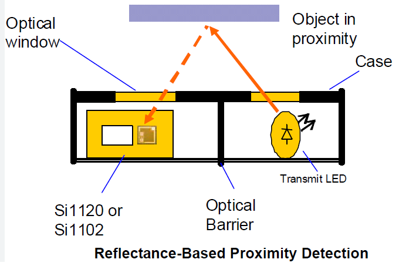

STEP SEVEN: Line Sensor Setup
======================

Overview
--------

In this lesson, you will learn how to use a QTR-MD-01A Reflectance Sensor to distinguish between light and dark surfaces. Specifically, this sensor will be used to detect the white line on the outside of the sumo ring. Below is an example of the sumo ring used in this contest.

.. image:: images/sumoring.PNG
      :width: 400px

The reflectance sensor you will be using to detect lines includes both an IR emitter and IR receiver. IR refers to light in the infrared spectrum, just above red and just outside of the visible spectrum. The diagram below shows an example of how reflectance sensors work. The detector on the left side of the diagram is triggered when it detects infrared light. There is lots of infrared light in the classroom, so it will dectect that as well. It is designed to be used very close to the surface of an object, so mostly it dectects only light from the LED emitter on the right. For the sensor to dectect infrared light from the emitter, it must reflet off a surface. In the case of white, a lot of infrared light is reflected. In the case of black not enough infrared light is reflected to trigger the sensor. 

Below is an image of the QTR-MD-01A sensor you will be using . Ulitmately, you will place two of these sensors on the bottom front of your robot facing down. 
The schematic for the sensor is shown below as well. On the left side of the schematic is the IR emitter which sends out infrared light. On the right of the schematic is the phototransistor which senses infrared light. The voltage at the OUT pin varies depending on how much infrared light is reflected from the IR emitter. You can check out the `product page <https://www.pololu.com/product/2458>`__  for additional information. 

.. image:: images/linesensor.PNG
      :width: 400px

.. image:: images/linesensorschematic.PNG
      :width: 400px
      
Specifications
-------
The sensor has three pins for power (labeled VCC), ground (labeled GND) and signal (labeled OUT). The sensor operates from 2.9 V to 5.5 V. The output signal is analog and should be connected to an analog port. While the sensor can detect objects from 30mm, it works optimally at 5mm.

Set up
--------
#. If the three control pins (VCC, GND, OUT) are not soldered, you can solder either three wires to the sensor or a right angle header. 
#. Connect the sensor to your breadboard, connecting VCC to the 5V bus and GND to ground.

Testing
--------
Using a multimeter, test that your sensor is working correctly.

#. Connect the signal lead (OUT) of the sensor to the red lead of your multimeter and the black (ground) lead to ground. I recommend using the alligator leads for this.
#. Set the meter to measure voltage. 
#. Power your circuit with either a USB cable or your battery supply.
#. Place a light or white object infront of your sensor and record the voltage.
#. Place a dark or black object infront of your sensor and record the voltage. 
#. Is the voltage higher or lower with a white object infront of the sensor?
#. Does it matter how far away the objects are from the sensor?
#. Repeat your tests at approximately 5mm which is the ideal sensing range for the sensor. 
