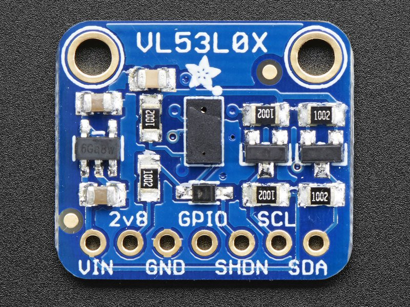

Sumo Distance Sensor TF
======================

Overview
--------

In this lesson, you will learn how to setup and use a VL53L0X time of flight (TOF) sensor to measure distance to determine the distance between your robot and another robot. The VL53L0X uses the elpase time it takes photons to travel between to points to measure distances from 3cm to 100cm. The device is 5V compatible on pin VIN and communciates via I2C on pins SDA and SCL.

Wiring
------

Above is a picture of the VL53L0X  module. Wire the module as follows.

GND pins to ground.

VIN pin to 5 volts

SCL pin to A5 on your Arduino or Metro

SDA pin to A4 on your Arduino or Metro

Initial Test
------------

Follow the instructions below to test that you have wired your module
correctly.

1. Install the VL53L0X library from Adafruit on your Arduino IDE.
2. Open the vl53l0x project from Examples.
3. Download the code to your board.

.. raw:: html

   <!-- end list -->

3. Open your terminal window.
4. Note that the code runs at 115200 so you will need to set this baud
   rate in the terminal window. You should see:

Adafruit VL53L0X test

VL53L0X API Simple Ranging example

...and then a set of distance readings in mm.

Range Testing
-------------

The following code should provide feedback if the object being measured
is between 50mm and 100mm from the sensor.

#include "Adafruit\_VL53L0X.h"

Adafruit\_VL53L0X lox = Adafruit\_VL53L0X();

int dist;

void setup() {

  Serial.begin(115200);

  lox.begin();

}

void loop() {

  VL53L0X\_RangingMeasurementData\_t measure;

  lox.rangingTest(&measure, false);

  dist = measure.RangeMilliMeter;

  if ((dist < 100) && (dist > 50))

    Serial.print("In the zone: ");

  Serial.println(dist);

  delay(100);

}
