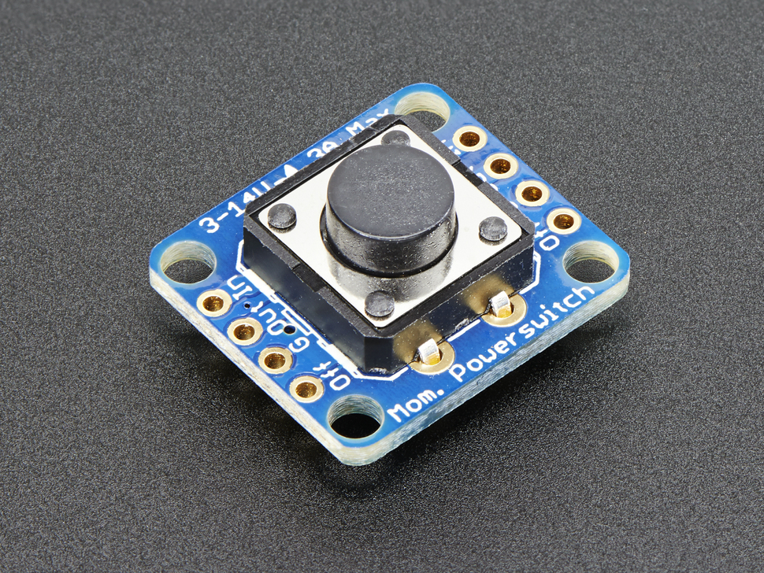

Soft Latching Switch
====================

Overview
--------

A soft latching switch provides an elegant and safe way to control power to your circuit. Unlike a mechanical latching switch which physically disconnects power from your circuit, the soft switch is controlled by a simple momentary switch. Press once and power is applied to the circuit. Press again and power is removed from the circuit. This is the sort of switch you find on most modern electronic devices. Notice that on your cell phone and many other devices you use there are no hard on/off switches. 

One complication of this design is that the power can never be completely off. The circuit must have some power even when it is off to detect the button press. Ideally, these types of switches draw less than one microamp.

For this project you will be using the `Adafruit Push-button Power Switch Breakout <https://www.google.com/url?q=https://www.adafruit.com/product/1400&sa=D&ust=1587613174159000>`__ This device will work with input power from 3V to 14VDC and can drive up to 3A

Set up
-------

#. Connect your power source (bench supply, voltage regulator or battery) to the ground G and IN pins on either side.

#. Connect your circuit's ground and power to the G and OUT pins on either side. 

#. Press the button and red LED should come on indicating that your circuit has power. 

#. Press the button again and the LED should turn off and remove power from your circuit.

TEACHER CHECK \_\_\_\_
