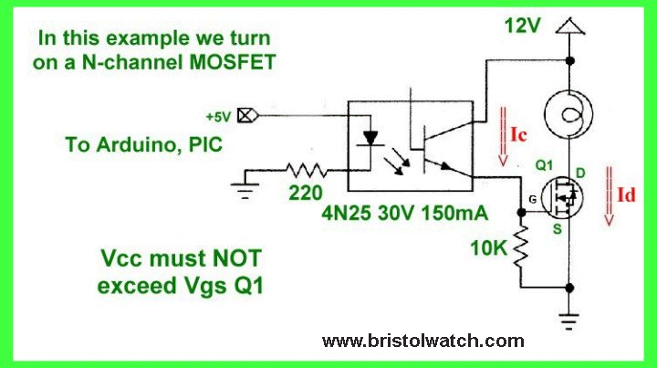

# Equalizer

[One](https://www.google.com/url?q=https://www.instructables.com/id/How-to-build-your-own-LED-Color-Organ-Arduino-MSGE/&sa=D&ust=1587613174378000)

[Two](https://www.google.com/url?q=http://www.whatimade.today/graphic-equalizer-using-esp8266-msgeq7-ws2812/&sa=D&ust=1587613174378000)

[Three](https://www.google.com/url?q=https://www.instructables.com/id/Music-Sync-Flashing-LEDs-Arduino-MSGEQ7/&sa=D&ust=1587613174379000)

[Four](https://www.google.com/url?q=https://www.eetimes.com/author.asp?section_id%3D216%26doc_id%3D1323003&sa=D&ust=1587613174379000)

[Five](https://www.google.com/url?q=https://www.baldengineer.com/msgeq7-simple-spectrum-analyzer.html&sa=D&ust=1587613174380000)

[Six](https://www.google.com/url?q=https://www.instructables.com/id/OLED-Spectrum-Analyzer-Warduino-MSGEQ7/&sa=D&ust=1587613174380000)

OPTO ISOLATION

