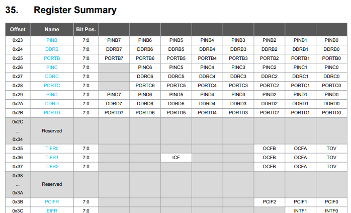

# Mcu Registers

## Overview

In this lesson, you will control your microcontroller be directly changing internal registers on the microcontroller. All of the functions you have used from setting a pin as an output to running serial commands are accomplished by setting and clearing bits in one of the eighty-eight 8-bit registers in the ATMega328.

Below is a partial table of all eighty-eight 8-bit working registers. This table can be found on page 428 of the ATMega328 datasheet.

