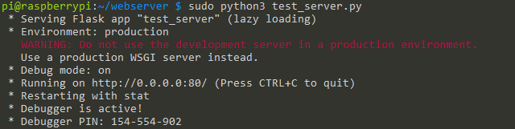
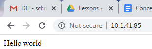
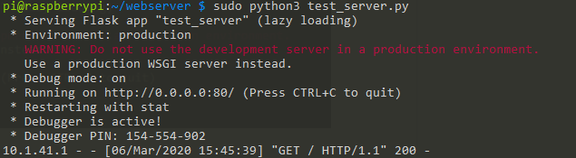

# Flask Webserver

## Overview

A good first project for your using Python with your RPI is to set up your own webserver.

Flask is a easy-to-use Python based webserver that will allow you have your RPI displaying web pages anywhere in your network.

# (Virtual Environment)

If you have not already done so, set up a virtual environment for your first Python projects. If you are not familiar with virtual environments check out the previous lesson.

# Install Flask

The first step in using Flask is to install it on your RPI. Log into your RPI. Activate your virtual environment. At the command prompt use pip to install Flask. Note that pip is a package manager for Python i.e. you use pip to install packages for Python. This is analogous to how you have used apt to install packages for Linux

#### $ pip install flask

# Set Up Directories

When you start a new project it is useful to create a folder where to have your files organized. For example:

#### $ mkdir rpiWebServer

The above command will create a folder named “rpiWebServer” where you will save your python files for this project. In this folder, let create two sub-folders: static for CSS and eventually JavaScript files and templates for HTML files. From within the rpiWebServer directory:

#### $ mkdir static

#### $ mkdir templates

Running the command ls from within the rpiWebServer directory should produce the following.

#### \~/rpiWebServer $ ls

#### static templates

#### 

# Write Server

Using Vim create a new file called helloWorld.py. Copy the following code into the file and save it in your rpiWebServer directory.

#### from flask import Flask

#### app = Flask(\_\_name\_\_)

#### @app.route('/')

#### def index():

####    return 'Hello world'

#### if \_\_name\_\_ == '\_\_main\_\_':

####    app.run(debug=True, port=80, host='0.0.0.0')

The following is an explanation of each line of the code.

The first line loads the Flask module into your Python script.

#### from flask import Flask

The second line creates a Flask object called app.

#### app = Flask(\_\_name\_\_)

The next two lines tell the code to  run the index() function when someone accesses the root URL (‘/’) of the server. In this case, it will just send the text “Hello World\!” to the client’s web browser thru “return”

#### def index():

####   return "Hello Word"

The final two lines make sure the server starts to “listen” on port 80 and report any errors.

#### if \_\_name\_\_ == '\_\_main\_\_':

####   app.run(debug=True, port=80, host='0.0.0.0')

# Running the Application

To run the application you simply need to type the following at the command prompt.

#### $ sudo python helloWorld.py

If there are no errors in your code, your terminal window should return text similar to what is shown in the image below. The application will be running unless you type \[CTRL\] + \[C\] which is what you will use to stop the program.

# Connecting to the Server

To connect to the server, you need to open a new tab on your web browser and type in the address (in the address window) for your RPI. The address is simply the four numbers you used to SSH into the RPI.  See the example below.

If your code is correct “Hello World” should appear in your browser.

# Tracking Connections

Every time you attempt to make a connection to the server, the server returns the status of that connection. A status of 200 indicates that the connection was OK, as seen below. It also returns the IP address of the client (your computer). Again, see below. Check [here](https://www.google.com/url?q=https://www.restapitutorial.com/httpstatuscodes.html&sa=D&ust=1587613174414000) for a list of other possible status code definitions. Check out status code 418. Yeah, it is real.

Try logging into your server from a different computer in the lab and note the response from the server.

# Templates and CSS

In this next step you will add an HTML template and CSS file to your server.

# HTML

Start by creating a file called index.html that includes the following text and save it in your templates directory.

#### \<\!DOCTYPE html\>

####   \<head\>

####      \<title\>{{ title }}\</title\>

####   \</head\>

####   \<body\>

####      \<h1\>Hello, World\!\</h1\>

####      \<h2\>The date and time on the server is: {{ time }}\</h2\>

####   \</body\>

#### \</html\>

Note that anything in double curly braces {{}} within the HTML template is interpreted as a variable that would be passed to it from the Python script via the render\_template function that you will add to your Python server script.

# New Flask Server

Create a new file in your main project directory using the following code. Save it as helloWorldTemplate.py.

#### from flask import Flask, render\_template

#### import datetime

#### app = Flask(\_\_name\_\_)

#### @app.route("/")

#### def hello():

####   now = datetime.datetime.now()

####   timeString = now.strftime("%Y-%m-%d %H:%M")

####   templateData = {

####      'title' : 'HELLO\!',

####      'time': timeString

####      }

####   return render\_template('index.html', \*\*templateData)

#### if \_\_name\_\_ == "\_\_main\_\_":

####   app.run(host='0.0.0.0', port=80, debug=True)

The following is a description of some of the new lines in this code file.

The line below is used to create an object called now that contains the present date and time

#### now = datetime.datetime.now()

This line formats the date and time in the now object using the following formatting options %Y-%m-%d %H:%M

####  timeString = now.strftime("%Y-%m-%d %H:%M")

The next set of lines create a dictionary called templateData with the key pairs title and time.

#### templateData = {

####      'title' : 'HELLO\!',

####      'time': timeString

####      }

In the next line, the python script passes the dictionary called templateData to the web browser.

#### return render\_template('index.html', \*\*templateData)

# Run the Code

Run your new python code by typing the following at the command line.

#### $ python helloWorldTemplate.py

Open any web browser and enter with your RPI’s IP address. Note that the page’s content changes dynamically each time the page is refreshed. The title remains a fixed value but the time changes every second.

# CSS

The next step is to include some styling on the page using a CSS file. Create a new file titled style.css with the following code. Save it to the static directory.

#### body {

####   background: blue;

####   color: yellow;

#### }

The next step is to modify index.html as shown below, so that it knows to look for the style.css file.

#### \<\!DOCTYPE html\>

####   \<head\>

####      \<title\>{{ title }}\</title\>

####      \<link rel="stylesheet" href="../static/style.css/"\>

####   \</head\>

####   \<body\>

####      \<h1\>Hello, World\!\</h1\>

####      \<h2\>The date and time on the server is: {{ time }}\</h2\>

####   \</body\>

#### \</html\>

Note that index.html is in the template directory and style.css is in the static directory.

# Dynamic Content

In this step you will add the ability to send data to the server and modify what it returns. Follow the guide [here](https://www.google.com/url?q=https://projects.raspberrypi.org/en/projects/python-web-server-with-flask/6&sa=D&ust=1587613174422000).
