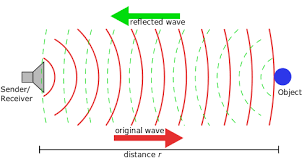
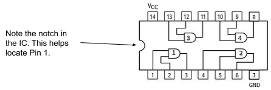
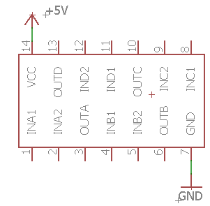
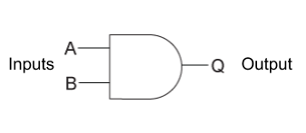

Low Latency Video
=================

Overview
--------

Possibly the best way to get low latency video streaming from a
Raspberry Pi is to use netcat and mplayer on the client and raspivid on
the server.

Raspivid
--------

Raspivid is installed by default with Raspian. It is very easy to use.
The following command provides a number of options allowing you to save
a video to your drive on the RPI.

$ raspivid -o newfile.h264 -t 4000 -a 12
~~~~~~~~~~~~~~~~~~~~~~~~~~~~~~~~~~~~~~~~

The o flag allows you to store the video at the specified file name. The
t flag determines on long in milliseconds the player will record. The a
flag inserts a time date on your video. The video will be stored in the
h264 format. You view this format using a VLC viewer but will need to
look up option settings. You can also look up how to convert the h264
format to mpeg.

Viewer
------

In order to connect to the raspivid player on the RPI you will be using
netcat and mplayer on your linux computer. If you are not running linux,
I can’t help you. The following command will start netcat to connect to
the RPI and pipe the output to mplayer.

$ netcat -l -p 5000 \|mplayer -fps 60 -cache 2048 -
~~~~~~~~~~~~~~~~~~~~~~~~~~~~~~~~~~~~~~~~~~~~~~~~~~~

Once this is running your linux computer you need to log into your RPI
and run the following command which will launch raspivid and pipe the
output to netcat connected to your local linux computer on port 5000

$ raspivid -t 0 - w 1280 -h 720 -o - \| nc 192.168.1.4 5000
~~~~~~~~~~~~~~~~~~~~~~~~~~~~~~~~~~~~~~~~~~~~~~~~~~~~~~~~~~~

NMAP

sudo nmap 10.1.41.1-100 -sn \|grep -B 2 -i raspberry
~~~~~~~~~~~~~~~~~~~~~~~~~~~~~~~~~~~~~~~~~~~~~~~~~~~~

SCP

Wired Communication

Limit Switch

Neopixel Strip

Voltage Regulator

Making Sounds

Switch Statement

Bluetooth Communication

Heat Dissipation

Motion Sensing

Light Detection

Stepper Driver

Pneumatics Driver

Drive Torque

Battery Selection

Reading Encoders

Data Logging

PCB Design

Alarm Clocks

Binary Clock

Feedback Loops

Distance Sensors

External Interrupts

Stroboscope

Timing Interrupts

Supercapacitors

ULTRASONIC SENSOR

Overview
--------

In this lesson you will use an ultrasonic sensor to measure distance.
Ultrasonic sensors include both a sender

out

NOT FINISHED
~~~~~~~~~~~~

BASIC LOGIC CIRCUIT

Overview
--------

Logic gates form the basis of all modern computers. A small `integrated
circuit <https://www.google.com/url?q=https://docs.google.com/document/d/1BmZbXzxnD2j17QToSZ9jeZmnP7burwfksfQq2v4zu-Y/edit%23heading%3Dh.sbb7uw38pmd5&sa=D&ust=1587613174525000>`__ no
bigger than your fingernail may contain millions of `logic
gates <https://www.google.com/url?q=https://docs.google.com/document/d/1BmZbXzxnD2j17QToSZ9jeZmnP7burwfksfQq2v4zu-Y/edit%23heading%3Dh.tclufllpksfy&sa=D&ust=1587613174525000>`__.
There are also small integrated circuits (ICs) that contain only a few
logic gates. In the really old days, computers were made completely from
these sorts of ICs. They are seldom used in modern circuits, but provide
a good exercise in learning about digital electronics.

AND Gate
--------

Below is the schematic symbol for an AND gate. Note that it has two
inputs and one output. The value of the output is determined by the
combined values of the inputs.

 |image0|

AND Gate

Below is diagram for integrated circuit that contains four AND gates.
Note the four AND gate symbols inside the AND gate. The specific IC has
the standard manufacturer number 74HC08.

74HC08

Exercise:
~~~~~~~~~

1. Placing the 74HC08

.. raw:: html

   <!-- end list -->

1. Set up your breadboard as described above with power and ground on
   both busses.
2. Find a 74HC08 in the grey bins in the storage closet. They are in the
   cabinet titled ICS, Transistors and MCU Related.
3. Place the 74HC08 on your breadboard. Make sure the notch is the left
   so that pin 1 is on the bottom (closest to you) of the board. Refer
   to the section in concepts on
   `breadboards <https://www.google.com/url?q=https://docs.google.com/document/d/1BmZbXzxnD2j17QToSZ9jeZmnP7burwfksfQq2v4zu-Y/edit%23heading%3Dh.utuueb8q3cey&sa=D&ust=1587613174527000>`__ for
   correct placement of an IC on a breadboard.

.. raw:: html

   <!-- end list -->

2. Powering your 74HC08. All electronics circuits require power. Just
   like you plug in a radio or toaster, you need to plug in your
   integrated circuit. (see schematic below)

.. raw:: html

   <!-- end list -->

1. Use a wire to connect the power pin (labeled Vcc in the diagram
   above) to the power
   `bus <https://www.google.com/url?q=https://docs.google.com/document/d/1BmZbXzxnD2j17QToSZ9jeZmnP7burwfksfQq2v4zu-Y/edit%23heading%3Dh.5vaws3722hif&sa=D&ust=1587613174527000>`__ of
   your breadboard.
2. Use another wire to connect the ground pin (labeled GND in the
   diagram above) to the ground bus of your breadboard.

TEACHER CHECK \_\_\_\_\_

3. Testing the logic gate.

.. raw:: html

   <!-- end list -->

1. Using two long (6 inch) jump wires to connect the two inputs for the
   first AND gate (pin 1 and pin 2) to the power bus.
2. Using another long jump wire connect the output to your multimeter in
   a way that it can be used to measure the voltage of the output pin.

TEACHER CHECK \_\_\_\_\_

4. Complete the following table by moving the input wires between the
   ground and power bus on your breadboard. Note that on your breadboard
   the `logic
   state <https://www.google.com/url?q=https://docs.google.com/document/d/1BmZbXzxnD2j17QToSZ9jeZmnP7burwfksfQq2v4zu-Y/edit%23heading%3Dh.wcd7fn4vlukr&sa=D&ust=1587613174528000>`__ HIGH
   is equivalent to 5V and the logic state LOW is equivalent ground.
   Using your multimeter to test the voltage at the output. For example,
   if the output reads ~5V on your meter than write HIGH in the output
   column. Note that the reading may not be exactly 5 volts.

74HC08        Gate Type: \_\_\_\_\_\_\_\_\_\_\_\_

+-----------+-----------+------------------------+
| Input A   | Input B   | Output (HIGH or LOW)   |
+-----------+-----------+------------------------+
| HIGH      | HIGH      |                        |
+-----------+-----------+------------------------+
| HIGH      | LOW       |                        |
+-----------+-----------+------------------------+
| LOW       | HIGH      |                        |
+-----------+-----------+------------------------+
| LOW       | LOW       |                        |
+-----------+-----------+------------------------+

5. Add an LED to the output pin of the first gate (pin 3). Make sure to
   include a resistor and orient the LED correctly.
6. Demonstrate how you can turn on and off the LED depending on the
   placement (HIGH/HOW) of the inputs.  

TEACHER CHECK \_\_\_\_\_

7. Each of the IC manufacturer numbers listed below represent ICs that
   contain between four and six logic gates each. For each of these ICs,
   wire the first gate on the IC and complete the table. If you need
   help with wiring the IC check out the ICs
   `datasheet <https://www.google.com/url?q=https://docs.google.com/document/d/1BmZbXzxnD2j17QToSZ9jeZmnP7burwfksfQq2v4zu-Y/edit%23heading%3Dh.4dzu3nqdxhp2&sa=D&ust=1587613174534000>`__.

74HC32        Gate Type: \_\_\_\_\_\_\_\_\_\_\_\_

+-----------+-----------+--------------------------+
| Input A   | Input B   | Output (LED ON or OFF)   |
+-----------+-----------+--------------------------+
| HIGH      | HIGH      |                          |
+-----------+-----------+--------------------------+
| HIGH      | LOW       |                          |
+-----------+-----------+--------------------------+
| LOW       | HIGH      |                          |
+-----------+-----------+--------------------------+
| LOW       | LOW       |                          |
+-----------+-----------+--------------------------+

74HC00        Gate Type: \_\_\_\_\_\_\_\_\_\_\_\_

+-----------+-----------+--------------------------+
| Input A   | Input B   | Output (LED ON or OFF)   |
+-----------+-----------+--------------------------+
| HIGH      | HIGH      |                          |
+-----------+-----------+--------------------------+
| HIGH      | LOW       |                          |
+-----------+-----------+--------------------------+
| LOW       | HIGH      |                          |
+-----------+-----------+--------------------------+
| LOW       | LOW       |                          |
+-----------+-----------+--------------------------+

74HC02         Gate Type: \_\_\_\_\_\_\_\_\_\_\_\_

+-----------+-----------+--------------------------+
| Input A   | Input B   | Output (LED ON or OFF)   |
+-----------+-----------+--------------------------+
| HIGH      | HIGH      |                          |
+-----------+-----------+--------------------------+
| HIGH      | LOW       |                          |
+-----------+-----------+--------------------------+
| LOW       | HIGH      |                          |
+-----------+-----------+--------------------------+
| LOW       | LOW       |                          |
+-----------+-----------+--------------------------+

74HC04        Gate Type: \_\_\_\_\_\_\_\_\_\_\_\_

+-----------+--------------------------+
| Input A   | Output (LED ON or OFF)   |
+-----------+--------------------------+
| HIGH      |                          |
+-----------+--------------------------+
| LOW       |                          |
+-----------+--------------------------+

