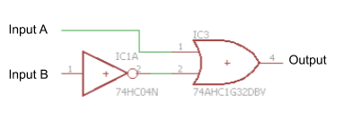
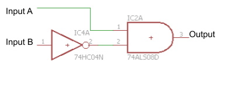
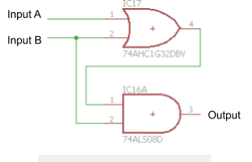
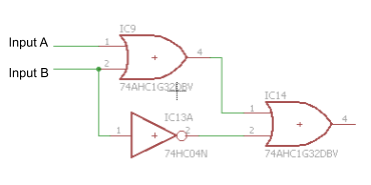
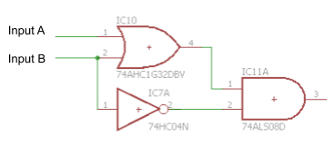

Complex Logic Circuits
======================

Overview
--------

By combining logic gates it is possible to be create increasingly
sophisticated circuits than can perform task from  adding two numbers
together to processing a video image. It is exactly these sorts of
complex sets of logic gates make up every modern computer based device.

Exercise:
~~~~~~~~~

1. For each gate, there is a specific shape used to represent that
   `gate <https://www.google.com/url?q=https://docs.google.com/document/d/1BmZbXzxnD2j17QToSZ9jeZmnP7burwfksfQq2v4zu-Y/edit%23heading%3Dh.tclufllpksfy&sa=D&ust=1587613174555000>`__.
   Complete the following table, filling in the shape for each gate
   listed.

+-------------+--------------+
| Gate Name   | Gate Shape   |
+-------------+--------------+
| AND         |              |
+-------------+--------------+
| OR          |              |
+-------------+--------------+
| NOT         |              |
+-------------+--------------+

2. Complete the following logic tables for each of the circuits given.
   Start with each pair of given inputs on the left and follow them
   through the circuit to determine the resulting output.

Input A

Input B

Output

(HIGH or LOW)

HIGH

HIGH

HIGH

LOW

LOW

HIGH

LOW

LOW

Input A

Input B

Output

(HIGH or LOW)

HIGH

HIGH

HIGH

LOW

LOW

HIGH

LOW

LOW

Input A

Input B

Output

(HIGH or LOW)

HIGH

HIGH

HIGH

LOW

LOW

HIGH

LOW

LOW

Input A

Input B

Output

(HIGH or LOW)

HIGH

HIGH

HIGH

LOW

LOW

HIGH

LOW

LOW

Input A

Input B

Output

(HIGH or LOW)

HIGH

HIGH

HIGH

LOW

LOW

HIGH

LOW

LOW

TEACHER CHECK \_\_\_\_\_
