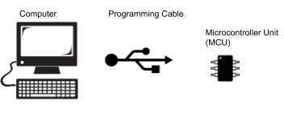
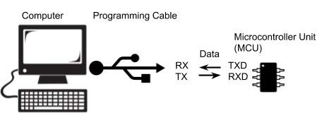

# Microcontrollers

## Overview

Microcontrollers are complex integrated circuits that can be programmed to perform automated tasks like a computer. They are used in everything from cars to microwave ovens. You will be using microcontrollers in most of your projects for the next four years. Since microcontrollers generally do not have keyboards and screens, engineers generally write programs on a desktop computer and then download the compiled code to the microcontroller through a programming cable as shown below.

# Circuit Diagram

The following is the [schematic](https://www.google.com/url?q=https://docs.google.com/document/d/1BmZbXzxnD2j17QToSZ9jeZmnP7burwfksfQq2v4zu-Y/edit%23heading%3Dh.r3k5lvbeyva&sa=D&ust=1587613174595000) for a basic microcontroller circuit. At the heart of the schematic is the [ATMega328](https://www.google.com/url?q=https://docs.google.com/document/d/1BmZbXzxnD2j17QToSZ9jeZmnP7burwfksfQq2v4zu-Y/edit%23heading%3Dh.bk51dfzckrxr&sa=D&ust=1587613174595000) which is the microcontroller in the circuit. It is important to note how [pins](https://www.google.com/url?q=https://docs.google.com/document/d/1BmZbXzxnD2j17QToSZ9jeZmnP7burwfksfQq2v4zu-Y/edit%23heading%3Dh.76esoxh2cjn0&sa=D&ust=1587613174595000) are ordered on every IC.

### Exercise:

Complete the above circuit as shown. Make sure to remove all previously used components from your breadboard before starting. Read here for a reminder on good [breadboarding](https://www.google.com/url?q=https://docs.google.com/document/d/1BmZbXzxnD2j17QToSZ9jeZmnP7burwfksfQq2v4zu-Y/edit%23heading%3Dh.7v7y9qmc8mp2&sa=D&ust=1587613174596000) practices.

TEACHER CHECK \_\_\_\_\_

# Programming Cable

The programming cable connects your microcontroller to the computer and allows you to send code compiled on the computer to your microcontroller. The code you write in C is first compiled into a [HEX file](https://www.google.com/url?q=https://docs.google.com/document/d/1BmZbXzxnD2j17QToSZ9jeZmnP7burwfksfQq2v4zu-Y/edit%23heading%3Dh.4towx11oahq6&sa=D&ust=1587613174596000) that is then downloaded to your computer via the USB cable. The cable communicates with your controller via the TXD, RXD and optionally Reset) pins on your microcontroller.

TXD Pin: TXD stands for transmit data and it is located at pin 3 of your microcontroller. This pin can be used to send data to other devices such as your computer. It is used for programming your microcontroller as well as general communication with your microcontroller.

RXD Pin: RXD stands for receive data and it is located at pin 2 of your microcontroller. This pin can be used to receive data from other devices such as your computer. It is used for programming your microcontroller as well as general communication with your microcontroller.

RESET: The reset pin can be used to reset the code running on the microcontroller. It is located on pin 1 of your microcontroller. A reset is performed by setting this pin LOW and then releasing it back to HIGH. This is important if your microcontroller gets stuck in a bad state.

Below is a table showing you how to connect your cable to your microcontroller. The black and red wires provide power to your board. Note that the RX (receive) on the cable side is connected to the TXD (transmit) on the microcontroller and the TX (transmit) on the cable side is connected to the RXD (receive) on the microcontroller. This should make sense.

|                        |                 |
| ---------------------- | --------------- |
| Cable                  | Microcontroller |
| RX (yellow)            | TXD             |
| TX (orange)            | RXD             |
| CTS (brown) NOT IN USE |                 |
| Ground (black)         |                 |
| 5V (red)               |                 |
| RTS (green) NOT IN USE |                 |

### You can find more info and technical specs at the [Adafruit Website (FTDI Serial TTL-232) USB Cable](https://www.google.com/url?q=https://cdn-shop.adafruit.com/datasheets/FT232_Model.pdf&sa=D&ust=1587613174603000)

### 

### Exercise:

Connect the programming cable to your microcontroller circuit.

TEACHER CHECK \_\_\_\_\_

APPENDIX

User Input: Construct circuits and software to read basic input devices including; momentary buttons, keypads, potentiometers and an IR remote (maybe separate with scope). Learn how to provide sound feedback and debounce a switch. Advanced: Use external interrupts to read a button.

User Display: Construct circuits and software to display data using LEDs, a 7-segment and an alphanumeric (LCD). Code a state-machine based menu selection process for the LCD. Advanced: Display data on a graphic display.

Serial Monitor: Use the serial monitor to display data from the microcontroller. Learn how to display and format multiple data in columns and with text separators. Create an interactive program for setting parameters on your microcontroller (i.e. setting the time).

Wired Communication: Understand the basics of a variety of communication protocols including USART, SPI, I2C, Onewire and USB. Code an example of each and visualize each of these protocols on the o-scope and logic analyzer. Know some advantages and disadvantages of each. Advanced: Code a basic interrupt driven serial driver.

Making Sounds: Understand the basics of creating sound waves to drive a piezo speaker. Know how to use this device to provide user feedback such as a button press, the end of an event or an alarm.

Making Waves: Know how to create simple square waves, view these on the o-scope and measure them using your meter. Understand frequency, period and pulse length. Create waves using simple loops as well as functions built into the Arduino library. Advanced: Create waves using interrupts.

Duty Cycle: Understand how to set and measure duty cycle using both basic loops and functions built into the Arduino library. View the duty cycle on an o-scope and measure average voltage using your meter.

Bluetooth Communication: Understand how to set up, send and receive data using a bluetooth module.

Heat Dissipation: Understand the problems with heat build-up on devices such as CPUs, motor drivers and LEDs. Learn techniques for dissipating heat with heat sinks and fans. Learn to match heat sinks to devices. Advanced: Design and machine heat sinks.

Temperature Sensors: Design circuits for using analog and digital temperature sensors. Learn how to design housings to create water tight sensors. Learn to about different sensors response time, range and accuracy. Learn to set up a multi-sensor network.

Motion Sensing: Design circuits to measure the angle of a device relative to level in three dimensions. Convert and display these angles in degrees and radians. Advanced: Determine motion of object based on input from inertial measurement unit (IMU).

Light Detection: Know how to use an infrared emitter and sensor pair as a reflective and “break beam” sensor. Understand the ideal sensing distance and about interference. Understand uses such as encoders, security, automation and pulse detectors. Demonstrate light passing through an “opaque” object.

Motor Driver: Know how to drive standard DC motor using a transistor and MOSFET. Understand how to use PWM to control speed and set ideal frequency.

Motor Modules: Know how to use standard motor modules and ICs to drive a bi-directional motor. Understand the basics of an h-bridge. Understand the importance of stall current, continuous current, peak current, over current protection, over temperature protection and current sense.

Stepper Driver: Understand how to build a basic transistor stepper driver. Display drive signals with logic analyzer. Understand how to use stepper modules and the basics of different step modes.

Pneumatics Driver: Understand how to set up a pneumatic drive system with air tank, regulator, solenoid valve and piston.

Drive Torque: Know how to calculate the required torque for driving a robot platform based on weight, wheel diameter, desired acceleration and maximum slope incline.

Battery Selection: Know how to select the correct battery based on voltage and current requirements. Calculate battery life based on circuit. Know the pros and cons of different battery chemistries. Know how to care for a LiPo battery.

Reading Encoders: Know how to design and test basic wheel encoders. Understand the difference between hall-effect and optical encoders. Understand the difference between reflective and transmissive encoders. Understand encoder resolution. Understand how to read the pulses from an encoder. Advanced: Understand how to design and read quadrature encoders.

Data Logging: Know how to store and retrieve data from the internal EEPROM on your ATMega328. Know how to store and retrieve data stored an external EEPROM. Advanced: Know how to store and retrieve data on a spreadsheet on an a PC.

PCB Design: Know how to design, print and solder a simple PCB (i.e. an IR sensor module).

Alarm Clocks: Know how to create an accurate one-second clock pulse using an external crystal. Understand the the importance of accuracy in timing. Know how to use an external timing IC to set and record dates and time. Know how to set a timing trigger point.

Feedback Loops: Know how to create a feedback loop. Understand PID control.

Hobby Servos

Distance Sensors: Know how to drive and read basic distance sensors including IR, Ultrasonic and TOF.  Understand the advantage of each and the uses such as measuring height..

External Interrupts: Understand how to set up an external interrupt to read the press of a button.

Timing Interrupts: Understand how to set internal timers to create internal clock signals.
